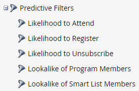
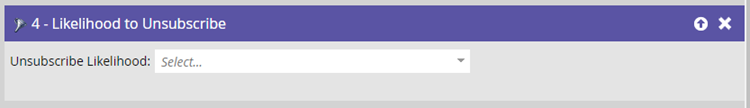

# Vorhersagefilter {#predictive-filters}

Als Teil der Predictive Audiences bietet Marketo eine Gruppe von KI-/ML-basierten Filtern in Smart Lists innerhalb von Smart-Kampagnen.

>[!NOTE]
>
>Die Filter „Wahrscheinlich anwesend“ und „Wahrscheinlich registriert“ können nur in Veranstaltungsprogrammen verwendet werden. „Wahrscheinlichkeit der Abmeldung“, „Lookalike der Programmmitglieder“ und „Lookalike der Mitglieder der Smart-Liste“ können in allen Programmtypen verwendet werden.

## Wahrscheinlichkeit der Teilnahme {#likelihood-to-attend}

Dieser Filter wird verwendet, um Ihre Audience effektiv einzugrenzen. Dies hilft Ihnen, Leads anzusprechen und einzuladen, die mit höherer Wahrscheinlichkeit an **Webinar** Veranstaltung teilnehmen. Beachten Sie, dass Ihr „Likelihood-Teilnahme-Programm“ Ihr aktuelles Veranstaltungsprogramm ist.

## Wahrscheinlichkeit der Registrierung {#likelihood-to-register}

Verwenden Sie diesen Filter ähnlich wie _Filter &quot;_ Teilnahme“, um Ihre Audience einzugrenzen und Leads anzusprechen, die eine höhere Wahrscheinlichkeit haben, sich für Ihr Webinar **Ihre Veranstaltung** registrieren.

## Wahrscheinlichkeit der Abmeldung {#likelihood-to-unsubscribe}

Dadurch wird die Zielgruppe nach der Wahrscheinlichkeit gefiltert, dass sie sich in den nächsten zwei Wochen mit hoher oder geringer Wahrscheinlichkeit abmeldet. Sie können dies verwenden, um Leads mit hoher Ermüdung anders und effektiver anzusprechen. Der Schwellenwert für die Abmeldung ist dynamisch und wird von einem KI-Modell gesteuert, das mehrere Attribute berücksichtigt, darunter Vorlaufzeit in der Datenbank und Lead-Aktivitäten.

>[!NOTE]
>
>Die Filter „Wahrscheinlichkeit für die Teilnahme/Registrierung/Abmeldung“ müssen in Verbindung mit anderen Standardfiltern verwendet werden.

## Lookalike der Programmmitglieder/Lookalike der Mitglieder der Smart-Liste {#lookalike-of-members}

Mit diesen beiden Filtern können Sie Ihre aktuelle Audience erweitern, indem Sie zusätzliche Leads ansprechen, die Mitgliedern eines anderen Programms oder einer Smart List ähnlich sind. Die Lookalike-Filter berücksichtigen mehr als 50 Faktoren, einschließlich Lead-Attribute, E-Mail-Aktivität, Web-Aktivität und Interaktion.

Klicken Sie **[!UICONTROL Einschränkung hinzufügen]**, um Erfolgskriterien für Mitglieder des/der ausgewählten Programms/Programme auszuwählen.

Klicken Sie auf das Symbol **+** , um mehrere Programme/Smart-Listen zu einem Filter hinzuzufügen.

## Zu beachtende Punkte {#things-to-note}

* Sie können auf eine Smart-Kampagne prädiktive Filter anwenden, selbst wenn das übergeordnete Programm erstellt wird, bevor prädiktive Filter aktiviert werden.
* Prädiktive Filter sind für Trigger-Kampagnen nicht verfügbar.
* Das Klonen oder Verschieben von Kampagnen mit prädiktiven Filtern wird nicht unterstützt.
* Sie können bis zu 5 prädiktive Filter in einer Smart-Liste verwenden.
* Wenn Marketo Engage bei der Auswertung prädiktiver Filter einen Fehler auftritt, wird die Kampagnenausführung automatisch abgebrochen und eine Benachrichtigung an das Marketo-Benachrichtigungszentrum gesendet.
* Prädiktive Filter haben derzeit eine Eingabegrenze von 1 Million qualifizierter Personen.
* Sie können bis zu 50 aktive Programme mit prädiktiven Filtern haben.
