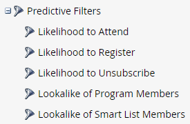

# Vorhersagefilter {#predictive-filters}

Im Rahmen von Predictive Audiences bietet Marketo eine Gruppe von KI/ML-basierten Filtern in Smart-Listen in Smart-Kampagnen.

>[!NOTE]
>
>Die Filter &quot;Wahrscheinlich teilnehmen&quot; und &quot;Wahrscheinlich registrieren&quot; können nur in Event- oder E-Mail-Programmen verwendet werden. &quot;Wahrscheinlichkeit der Abmeldung&quot;, &quot;Look-alike der Programmmitglieder&quot;und &quot;Lookalike der Smart List Members&quot;können in allen Programmtypen verwendet werden.

## Wahrscheinlichkeit der Teilnahme {#likelihood-to-attend}

Mit diesem Filter können Sie Ihre Zielgruppe effektiv eingrenzen. Auf diese Weise können Sie Leads auswählen und einladen, die eine höhere Wahrscheinlichkeit haben **Besuch** Ihr Webinar oder Ihre Veranstaltung Beachten Sie, dass Ihr aktuelles Ereignisprogramm &quot;Wahrscheinlichkeit, am Programm teilzunehmen&quot;ist.

## Wahrscheinlichkeit der Registrierung {#likelihood-to-register}

Ähnlich wie bei _Wahrscheinlichkeit der Teilnahme_ Filter verwenden, um Ihre Zielgruppe einzugrenzen und Leads auszuwählen, die eine höhere Wahrscheinlichkeit von **registrieren** für Ihr Webinar oder Ihre Veranstaltung.

## Wahrscheinlichkeit der Abmeldung {#likelihood-to-unsubscribe}

Dadurch wird die Zielgruppe danach gefiltert, ob die Abmeldewahrscheinlichkeit in den nächsten zwei Wochen hoch oder niedrig ist. Sie können dies verwenden, um Leads mit hoher Ermüdung unterschiedlich und effektiver auszurichten. Der Schwellenwert für die Abmeldung ist dynamisch und wird von einem KI-Modell gesteuert, das verschiedene Attribute berücksichtigt, einschließlich der Vorlaufzeit in der Datenbank und der Lead-Aktivitäten.

>[!NOTE]
>
>Die Wahrscheinlichkeit eines An-/Registrieren/Abmelden von Filtern muss in Verbindung mit anderen Standardfiltern verwendet werden.

## Look-alike der Programmmitglieder/Lookalike der Smart-List-Mitglieder {#lookalike-of-members}

Mit diesen beiden Filtern können Sie Ihre aktuelle Zielgruppe erweitern, indem Sie zusätzliche Leads auswählen, die den Mitgliedern eines anderen Programms oder einer intelligenten Liste ähnlich sind. Die Suchfilter berücksichtigen mehr als 50 Faktoren, einschließlich Lead-Attributen, E-Mail-Aktivität, Web-Aktivität und Interaktion.

Klicks **[!UICONTROL Beschränkung hinzufügen]** um Erfolgskriterien für die Mitglieder des ausgewählten Programms/der ausgewählten Programme auszuwählen.

Klicken Sie auf **+** -Symbol, um einfach mehrere Programme/Smart-Listen zu einem Filter hinzuzufügen.

## Zu beachten {#things-to-note}

* Sie können Prädiktive Filter auch dann auf eine Smart-Kampagne anwenden, wenn das übergeordnete Programm erstellt wurde, bevor Prädiktive Filter aktiviert wurden.
* Predictive Filter sind nicht für Trigger-Kampagnen verfügbar.
* Das Klonen oder Verschieben von Kampagnen, die prädiktive Filter enthalten, wird nicht unterstützt.
* Sie können bis zu 5 prädiktive Filter in einer Smart-Liste verwenden.
* Wenn bei der Marketo Engage ein Fehler bei der Auswertung von Predictive Filters auftritt, wird der Kampagnenablauf automatisch abgebrochen und Sie erhalten eine Benachrichtigung im Benachrichtigungszentrum von Marketo.
* Prädiktive Filter haben derzeit eine Eingabeschwelle von 1 Million qualifizierten Personen.
* Sie können bis zu 50 aktive Programme mit Prädiktiven Filtern haben.
