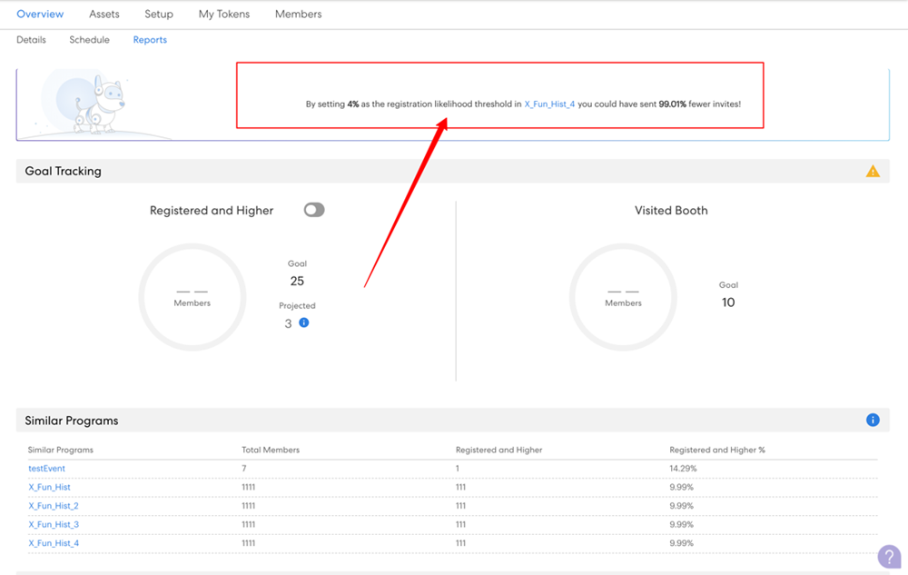
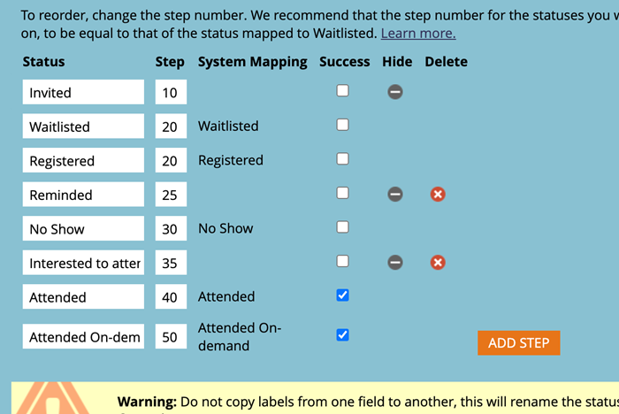

# Grundlegendes zu Zielverfolgung und geplanten Registrierungen {#understanding-goal-tracking-and-projected-registrations}

So verfolgen Sie Ihren Zielfortschritt und verstehen die Prognosen von Marketo.

>[!PREREQUISITES]
>
>Um auf die meisten dieser Funktionen zuzugreifen, müssen Sie den Umschalter [nächste Generation](/help/marketo/product-docs/marketo-engage-modern-ux/toggle-switch.md){target="_blank"} für Ereignisprogramme aktivieren.

>[!NOTE]
>
>Wenn ein Ereignisprogramm in Marketo Classic Experience Platform erstellt wird, wird als Startdatum des Ereignisses derzeit standardmäßig das Ereigniserstellungsdatum verwendet. Da bei geplanten Registrierungen die Zeit vor dem Startdatum eines Ereignisses berücksichtigt wird, sind diese Zahlen möglicherweise nicht korrekt, wenn das Startdatum und das Erstellungsdatum identisch sind (es sei denn, sie werden absichtlich festgelegt).

## Zielverfolgung und geplante Registrierungen

1. Details zur Zielverfolgung finden Sie auf der Registerkarte **[!UICONTROL Berichte]** Ihres Veranstaltungsprogramms. In diesem speziellen Beispiel gibt es bisher 150 registrierte Mitglieder gegen ein Ziel von 200 (75 %).

   

Außerdem werden Ihre &quot;**[!UICONTROL &quot; Registrierungen]**. Bewegen Sie den Mauszeiger über das Informationssymbol, um eine Aufschlüsselung dieser Zahl nach Wahrscheinlichkeitssegment anzuzeigen.

>[!NOTE]
>
>Die Diagramme Teilgenommen und Höher bleiben bis zum Veranstaltungstag leer.

Wenn Sie den Umschalter nicht aktiviert haben, wird er wie folgt in der Benutzeroberfläche der Marketo-Klasse angezeigt:

1. Klicken Sie auf den Umschalter Diagramm , um zu einer Aufschlüsselung der Mitglieder nach Registrierungswahrscheinlichkeit zu wechseln. Sie sehen die aktuellen Registrierungsprozentsätze für jedes Segment im Vergleich zum durchschnittlichen Prozentsatz für dieses Segment in Ihren vorherigen Programmen.

   

Alle Mitglieder (registrierte und noch nicht registrierte) werden auf der Grundlage ihrer Registrierungswahrscheinlichkeit kategorisiert. Bewegen Sie den Mauszeiger über das Infosymbol, um zu sehen, wie diese Wahrscheinlichkeitskategorien definiert werden.

>[!NOTE]
>
>Prognosezahlen werden alle 24 Stunden bis zum Tag des Ereignisses aktualisiert. Alle Mitglieder, die als _Verarbeitung_ aufgeführt sind, werden in den nächsten Berechnungszyklus einbezogen.

## Ähnliche Programme

Sie können einen Einblick in Ihr aktuelles Ereignis erhalten, indem Sie sich ansehen, wie ähnliche Programme in der Vergangenheit durchgeführt wurden. In diesem Abschnitt werden bis zu 5 ähnliche Programme aus den letzten 6 Monaten mit der Anzahl/dem Prozentsatz der Mitglieder angezeigt, die _registriert_ oder höher waren.

Bei der Berechnung ähnlicher Programme berücksichtigen wir unter anderem die folgenden Faktoren:

* Programmtyp
* Programmkanal
* Zielgruppengröße
* Programm-Tags
* Zeitdauer von der Ereigniserstellung bis zum Ereignisstart
* Ereignisdauer

  

## Empfehlungen

Oben auf der Seite [!UICONTROL Berichte] finden Sie KI-/ML-gesteuerte Empfehlungen, die auf Ihrem Fortschritt basieren. Schauen Sie regelmäßig vorbei, um hilfreiche Tipps und Einblicke zu erhalten!

## Prognosen auf Personenebene

Klicken Sie auf die **[!UICONTROL Mitglieder]**, um alle Ihre Programmmitglieder anzuzeigen. Bewegen Sie den Mauszeiger über die **[!UICONTROL Registrierungswahrscheinlichkeit]** oder **[!UICONTROL Anwesenheitswahrscheinlichkeit]** Balken, um genaue Prozentsätze und Kategorisierungen anzuzeigen. Sie können dann Aktionen für Mitglieder in einer bestimmten Kategorie durchführen (z. B. für alle Personen in der Kategorie „Weniger wahrscheinlich“, die sich registrieren) und sie gezielt ansprechen, um Ihre Registrierungszahlen möglicherweise zu erhöhen.

>[!NOTE]
>
>Die individuelle Wahrscheinlichkeit berücksichtigt mehr als 40 Personenfaktoren, einschließlich Profilattribute, Personenaktivität und früherer eingeladener/registrierter/teilgenommener Aktivitäten.

## FAQs

**F: Was ist das Segment?**

A: Wahrscheinlich wird ein Wert zwischen 0 und 100 registriert. Jede Person, die Mitglied des Veranstaltungsprogramms ist, erhält einen Wahrscheinlichkeitswert zwischen 0 und 100.

Wir gliedern die Wahrscheinlichkeitswerte in drei Segmente:

* Wahrscheinlichkeit der Registrierung > 50 % = sehr wahrscheinliches Segment
* Wahrscheinlichkeit der Registrierung >25 % bis &lt;50 % = Wahrscheinliches Segment
* Wahrscheinlichkeit der Registrierung &lt; 25 % = weniger wahrscheinliches Segment

Wenn eine Person die Wahrscheinlichkeit erhält, sich zu registrieren, fällt die Prognose in eines dieser Segmente (jede Person, die Mitglied eines Programms ist, fällt in eines dieser Segmente). Wenn beispielsweise ein Veranstaltungsprogramm basierend auf den Wahrscheinlichkeitsprognosen 1.000 Mitglieder hat, werden diese 1.000 in die Segmente _Mit hoher Wahrscheinlichkeit_, _Wahrscheinlich_ oder _Weniger_ verteilt.

Daher haben Personen, die in das Segment mit hoher Wahrscheinlichkeit fallen, eine höhere Chance, sich für die Veranstaltung zu registrieren.

Konversion in Register = Anzahl der registrierten Personen im Segment dividiert durch die Anzahl der Personen, die in das Segment fallen (z. B. wenn 100 Personen in das Segment mit hoher Wahrscheinlichkeit fallen und 60 von ihnen sich registrieren, beträgt die Konversionsrate 60 %).

Die Konversion % zur Registrierung folgt diesem Muster: Sehr wahrscheinlich > Wahrscheinlich > Weniger wahrscheinlich.

**F: Wie verwende ich die Einblicke?**

A. Best Practice umfasst Folgendes:

i. Sie erstellen ein Programm und dann verwendet eine intelligente Kampagne prädiktive Filter mit „größer als X“, was dazu führen würde, dass eine bestimmte Anzahl von Personen (beispielsweise 1.000) die Kampagne ausführen.

II. Nach 24 Stunden werden auf der Registerkarte [!UICONTROL Berichte] die voraussichtlichen Registrierungen angezeigt, die auf der Grundlage der Wahrscheinlichkeit berechnet werden, Werte aller Personen zu registrieren, die derzeit eingeladen sind.

III. Wenn die geplanten Registrierungen geringer sind als das Ziel, müssten Sie mehr Personen einladen. An dieser Stelle können Sie die Einblicke sehen, die Ihnen erzählen, was die Schwelle war, die in früheren Programmen funktionierte.

IV. Sie können eine neue intelligente Kampagne mit diesem Schwellenwert erstellen, um mehr Personen einzuladen.

v. Wenn Sie wissen möchten, warum eine projizierte Zahl angezeigt wird, können Sie jederzeit die Zielgruppenverteilung auf die Segmente und deren Konversionsraten aus der Vergangenheit anzeigen und diese Konversionsraten auf die aktuelle Zielgruppe anwenden (siehe Screenshot unten).

**F: Was ist das Diagramm Segmente nach Registrierung?**

A: Drei Balken, von denen jeder ein Segment darstellt (sehr wahrscheinlich, wahrscheinlich, weniger wahrscheinlich).

**Violette gepunktete Linie:** Durchschnittliche Gesprächsrate zur Registrierung in diesem Segment, basierend auf früheren ähnlichen Programmen.

**Blauer Balken** Registrierungsprozentsatz aller Personen in diesem Segment.

Nehmen wir beispielsweise an, 100 Personen registrieren sich mit einer Wahrscheinlichkeit von > 50 %, und 60 von diesen 100 registrierten Personen. Mit hoher Wahrscheinlichkeit liegt die Konversionsrate bei 60 %. Alle zum Programm hinzugefügten Mitglieder erhalten also die Wahrscheinlichkeit, Werte zu registrieren, dann werden sie in Segmente eingeschlossen und gemäß der Anzahl der Personen, die in jeder Segmentkonversionsrate registriert sind, berechnet.

**F: Was bedeutet „Registriert und höher“?**

A: Jede Person, die als registriert aufgeführt ist, oder jeder andere Status mit einer gleichen oder höheren Schrittnummer.

Sie können neue Fortschrittsstatus für ein Ereignisprogramm erstellen, aber wir ordnen diese Status mit Standardstatus zu. Stellen Sie sich einen Fall vor, in dem eine Person von einer eingeladenen zur Erinnerung verschoben wird, was einen höheren Schritt als die Registrierung darstellt. Diese Person wird auch als registriert betrachtet und in der Zielverfolgung angezeigt.

**F: Wie werden die geplanten Registrierungen berechnet?**

A: Siehe unten.

