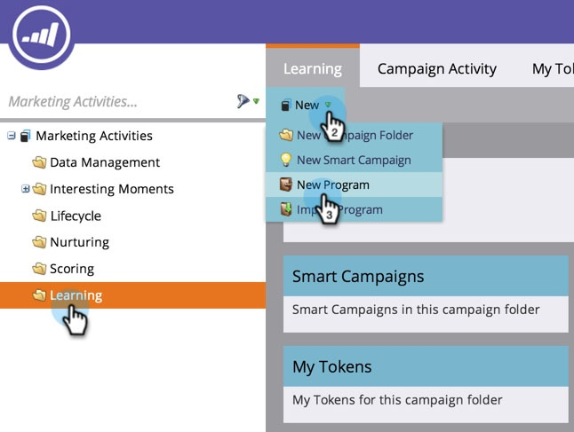

# Programm erstellen {#create-a-program}

Programme sind eines der wichtigsten Elemente in Marketo. Du wirst sie viel benutzen!

1. Wechseln Sie zu **[!UICONTROL Marketingaktivitäten]**.

   

1. Wählen Sie den Ordner für das neue Programm aus. Wählen Sie **[!UICONTROL Neu]** und klicken Sie auf **[!UICONTROL Neues Programm]**.

   

1. Geben Sie einen **[!UICONTROL Namen]** ein, wählen Sie einen **[[!UICONTROL Kanal]](/help/marketo/product-docs/administration/tags/create-a-program-channel.md){target="_blank"}** in der Dropdown-Liste aus und klicken Sie auf **[!UICONTROL Erstellen]**.

   

>[!MORELIKETHIS]
>
>[Programme verstehen](/help/marketo/product-docs/core-marketo-concepts/programs/creating-programs/understanding-programs.md){target="_blank"}.
