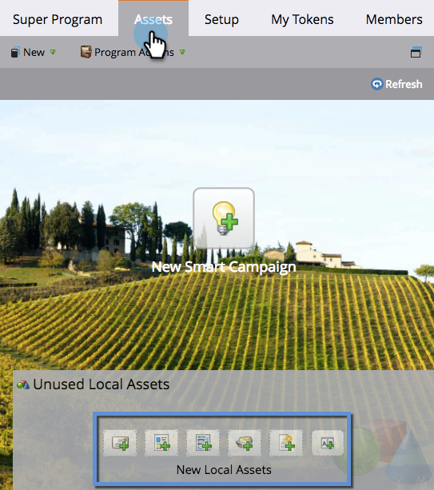

# Verwenden der Registerkarte Assets {#using-the-assets-tab}

Die Asset-Arbeitsfläche ist eine visuelle Darstellung Ihres Standard- oder Ereignisprogramms. Sie können damit lokale Assets hinzufügen und mit vorhandenen interagieren.

## Hinzufügen von Assets {#adding-assets}

Klicken Sie im ]**Programm auf die Registerkarte**[!UICONTROL  Assets. Wählen Sie eines der folgenden Assets aus und fügen Sie es zu Ihrem Programm hinzu.

## Programm verwalten  {#manage-your-program}

Wenn Assets in Ihrem Programm vorhanden sind, werden sie hier aufgelistet.

| Orange | Auslöser-Kampagne |
|---|---|
| Grün | Stapel-Kampagne |

Wenn Sie mit diesem Asset interagieren möchten, können Sie mit der rechten Maustaste auf die Kopfzeile klicken.

>[!TIP]
>
>Ziehen und Ablegen, um die Asset-Spalten neu anzuordnen.

Assets, die nicht lokal in Ihrem Programm sind, sehen wie folgt aus:

Die Registerkarte Assets ist ein großartiges kleines Dashboard für alles, was sich im Programm befindet und darauf verweist.
