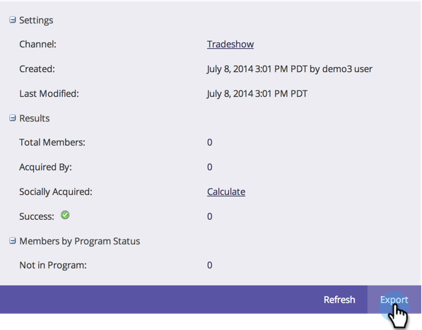
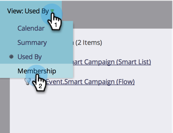

# Verwenden der Registerkarte „Startseite“ des Programms {#using-the-program-home-tab}

Die Registerkarte „Programm-Startseite“ bietet einen umfassenden Überblick über den Status in Ihrem Programm.

## Zusammenfassungsansicht {#summary-view}

1. Navigieren Sie **[!UICONTROL Marketing-Aktivitäten]**.

   

1. Programm auswählen.

   

   >[!NOTE]
   >
   >Dies ist die Standardansicht. Es enthält Informationen zu Ihren Einstellungen, zum Zeitplan, den Ergebnissen und zum Programmstatus für Mitglieder.

1. Klicken Sie auf unterstrichene Elemente, um Änderungen vorzunehmen oder weitere Informationen anzuzeigen.

   

1. Klicken **[!UICONTROL unten]** der Zusammenfassung auf „Exportieren“, um den Bericht herunterzuladen.

   

## Von Ansicht verwendet {#used-by-view}

1. Wählen **[!UICONTROL unter &quot;]**&quot; ein Programm aus.

   

1. Klicken Sie auf **[!UICONTROL Dropdown-]** Ansicht“. Wählen Sie **[!UICONTROL Verwendet von]**.

   

   Diese Ansicht zeigt Ihnen, welche intelligenten Kampagnen verwendet werden.

   

## Mitgliedschaftsansicht {#membership-view}

1. Wählen **[!UICONTROL unter &quot;]**&quot; ein Programm aus.

   

1. Klicken Sie auf **[!UICONTROL Dropdown-]** Ansicht“. Wählen Sie **[!UICONTROL Mitgliedschaft]** aus.

   

   Dies zeigt Ihnen ein Diagramm, in dem die Mitglieder beim Durchlaufen des Programmstatus stehen.

   

   >[!NOTE]
   >
   >**[!UICONTROL Historisch]** bedeutet jeden, der das Programm jemals durchlaufen hat, während **[!UICONTROL Aktuell]** nur Personen umfasst, die derzeit im Programm sind.

   >[!MORELIKETHIS]
   >
   >[Grundlegendes zur Programmmitgliedschaft](/help/marketo/product-docs/core-marketo-concepts/programs/creating-programs/understanding-program-membership.md){target="_blank"}
