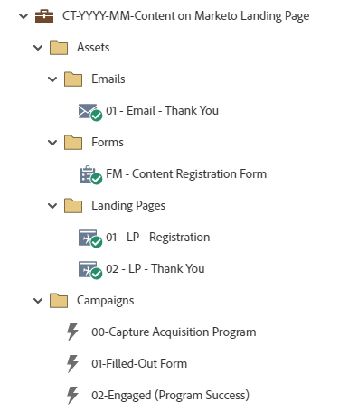

# CT-YYY-MM-Content auf der Marketo-Landingpage {#ct-yyyy-mm-content-on-marketo-landing-page}

Dieses Beispiel ist als Inhaltsprogramm konzipiert, das eine Marketo Engage-Landingpage mit einem Marketo Engage-Formular nutzt, das ein Marketo Engage-Standardprogramm verwendet. Das Formular dient dem Zugriff auf den Inhalt/das Angebot. Der Link zum Angebot kann auf der Dankeseite angezeigt, in einer Dankesemail oder in beiden.

Weitere Hilfe zur Strategie oder Hilfe bei der Anpassung eines Programms erhalten Sie vom Adobe-Account-Team oder unter [Adobe Professional Services](https://business.adobe.com/customers/consulting-services/main.html){target="_blank"} Seite.

## Kanal-Zusammenfassung {#channel-summary}

<table style="table-layout:auto"> 
 <tbody> 
  <tr> 
   <th>Kanal</th> 
   <th>Status der Mitgliedschaft</th>
   <th>Analyseverhalten</th>
   <th>Programmtyp</th>
  </tr> 
  <tr> 
   <td>Webinhalt</td> 
   <td>01-Mitglied 
 02-Engaged-Success</td>
   <td>Inklusiv</td>
   <td>Standard</td>
  </tr>
 </tbody> 
</table>

## Das Programm enthält die folgenden Assets {#program-contains-the-following-assets}

<table style="table-layout:auto"> 
 <tbody> 
  <tr> 
   <th>Typ</th> 
   <th>Vorlagenname</th>
   <th>Asset-Name</th>
  </tr> 
  <tr> 
   <td>E-Mail</td> 
   <td><a href="/help/marketo/product-docs/core-marketo-concepts/programs/program-library/quick-start-email-template.md" target="_blank">Schnellstart-E-Mail-Vorlage</a></td>
   <td>01-Email-Vielen Dank</td>
  </tr>
  <tr> 
   <td>Landing Page</td> 
   <td><a href="/help/marketo/product-docs/core-marketo-concepts/programs/program-library/quick-start-landing-page-template.md" target="_blank">Schnellstart-LP-Vorlage</a></td>
   <td>01 - LP - Registrierung</td>
  </tr>
  <tr> 
   <td>Landing Page</td> 
   <td><a href="/help/marketo/product-docs/core-marketo-concepts/programs/program-library/quick-start-landing-page-template.md" target="_blank">Schnellstart-LP-Vorlage</a></td>
   <td>02 - LP - Vielen Dank</td>
  </tr>
  <tr> 
   <td>Formular</td> 
   <td> </td>
   <td>FM - Formular zur Inhaltsregistrierung</td>
  </tr>
  <tr> 
   <td>Lokaler Bericht</td> 
   <td> </td>
   <td>E-Mail-Leistung</td>
  </tr>
  <tr> 
   <td>Lokaler Bericht</td> 
   <td> </td>
   <td>Landing Page-Leistung</td>
  </tr>
   <tr> 
   <td>Intelligente Kampagne</td> 
   <td> </td>
   <td>00 - Akquiseprogramm erfassen</td>
  </tr>
  <tr> 
   <td>Intelligente Kampagne</td> 
   <td> </td>
   <td>01 - Ausgefülltes Formular</td>
  </tr>
  <tr> 
   <td>Intelligente Kampagne</td> 
   <td> </td>
   <td>02 - Interagiert (Programmerfolg)</td>
  </tr>
  <tr> 
   <td>Ordner</td> 
   <td> </td>
   <td>Assets - Häusert alle Kreativ-Assets 
 (Unterordner für E-Mails, Landingpages und Forms)  </td>
  </tr>
  <tr> 
   <td>Ordner</td> 
   <td> </td>
   <td>Kampagnen - Alle Smart-Kampagnen werden beherbergt</td>
  </tr>
  <tr> 
   <td>Ordner</td> 
   <td> </td>
   <td>Berichte</td>
  </tr>
 </tbody> 
</table>

## Meine Token Enthalten {#my-tokens-included}

<table style="table-layout:auto"> 
 <tbody> 
  <tr> 
   <th>Token-Typ</th> 
   <th>Token-Name</th>
   <th>Wert</th>
  </tr> 
  <tr> 
   <td>RTF</td> 
   <td><code>{{my.Content-Description}}</code></td>
   <td>Doppelklicken für Details  
 <code><--My Content Description Here--></code> 
 Bearbeiten Sie diese Inhaltsbeschreibung auf Programmebene auf der Registerkarte My Tokens . 
 Sie werden Folgendes erfahren: 
<li>Aufzählungszeichen 1</li>
<li>Aufzählungszeichen 2</li>
<li>Aufzählungszeichen 3</li></td>
  </tr>
  <tr> 
   <td>Text</td> 
   <td><code>{{my.Content-Title}}</code></td>
   <td><code><--My Content Title Here--></code></td>
  </tr>
  <tr> 
   <td>Text</td> 
   <td><code>{{my.Content-Type}}</code></td>
   <td><code><--My Content Type Here--></code></td>
  </tr>
  <tr> 
   <td>Text</td> 
   <td><code>{{my.Content-URL}}</code></td>
   <td>my.ContentURL?without=http://</td>
  </tr>
  <tr> 
   <td>Text</td> 
   <td><code>{{my.Email-FromAddress}}</code></td>
   <td>PlaceholderFrom.email@mydomain.com</td>
  </tr>
  <tr> 
   <td>Text</td> 
   <td><code>{{my.Email-FromName}}</code></td>
   <td><code><--My From Name Here--></code></td>
  </tr>
  <tr> 
   <td>Text</td> 
   <td><code>{{my.Email-ReplyToAddress}}</code></td>
   <td>reply-to.email@mydomain.com</td>
  </tr>
  <tr> 
   <td>Text</td> 
   <td><code>{{my.PageURL-ThankYou}}</code></td>
   <td>My.Vielen DankYouPageURL?ohne http://</td>
  </tr>
 </tbody> 
</table>

## Konfliktregeln {#conflict-rules}

* **Programm-Tags**
   * Erstellen von Tags in diesem Abonnement - _Empfohlen_
   * Ignorieren

* **Landingpage-Vorlage mit demselben Namen**
   * Originalvorlage kopieren
   * Zielvorlage verwenden - _Empfohlen_

* **Bilder mit demselben Namen**
   * Beide Dateien beibehalten
   * Element in diesem Abonnement ersetzen - _Empfohlen_

* **E-Mail-Vorlagen mit demselben Namen**
   * Beide Vorlagen beibehalten
   * Vorhandene Vorlage ersetzen - _Empfohlen_

## Bewährte Methoden {#best-practices}

* Verschieben Sie das Formular nach dem Import des Inhaltsprogramms von einem lokalen Asset in ein globales Asset in Design Studio.
   * Die Verringerung der Anzahl von Formularen und die Verwendung von mehr globalen Assets aus Design Studio ermöglichen eine größere Skalierbarkeit in der Programmentwicklung und Verwaltungsführung. Es bietet außerdem Flexibilität bei regelmäßigen Aktualisierungen der Kompatibilität für Felder, Opt-in-Sprache usw.

* Aktualisieren Sie die Vorlagen in Ihrem importierten Programm, um die derzeit verwendeten Vorlagen zu verwenden, oder aktualisieren Sie die neu importierte Vorlage entsprechend Ihrer Marke, indem Sie einen Ausschnitt oder Ihre entsprechenden Logos-/Fußzeileninformationen hinzufügen.

* Erwägen Sie, die Benennungsregel dieses Programmbeispiels zu aktualisieren, um sie an Ihre Benennungsregel anzupassen.

>[!NOTE]
>
>Denken Sie daran, die &quot;My Token Values&quot;-Werte in der Programmvorlage und jedes Mal, wenn Sie das Programm verwenden, nach Bedarf zu aktualisieren.

>[!TIP]
>
>Vergessen Sie nicht, die Kampagne &quot;02-engagiert&quot;zu aktivieren, um den Erfolg zu verfolgen! Verwenden Sie dies _before_ Ihr Formular ist live und E-Mails werden gesendet.

>[!IMPORTANT]
>
>Meine Token, die auf eine URL verweisen, können http:// oder https:// nicht enthalten. Andernfalls funktioniert der Link im Asset nicht ordnungsgemäß.
