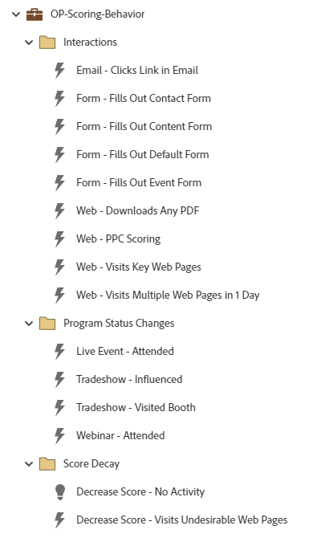

# OP-Scoring-Verhalten {#op-scoring-behavior}

Dieses Beispiel ist ein erweitertes (tokenisiertes) operationelles Programm für die Verhaltensbewertung unter Verwendung eines Marketo Engage-Standardprogramms. Zeigen Sie die Scoring-Werte auf der Registerkarte „Meine Token“ des Programms an und bearbeiten Sie sie. Erfordert ein benutzerdefiniertes Bewertungsfeld namens „Verhaltensbewertung“.

Wenden Sie sich an das Adobe-Accountteam oder besuchen Sie die Seite [Adobe Professional Services](https://business.adobe.com/customers/consulting-services/main.html){target="_blank"}, um weitere Unterstützung bei der Strategie oder bei der Anpassung eines Programms zu erhalten.

## Kanal-Zusammenfassung {#channel-summary}

<table style="table-layout:auto">
 <tbody>
  <tr>
   <th>Kanal</th>
   <th>Mitgliedschaftsstatus</th>
   <th>Analytics Behavior</th>
   <th>Programmtyp</th>
  </tr>
  <tr>
   <td>Betrieblich</td>
   <td>01-Mitglied</td>
   <td>Betrieblich</td>
   <td>Standard</td>
  </tr>
 </tbody>
</table>

## Vorausgesetzte Felder {#prerequisite-fields}

<table style="table-layout:auto">
 <tbody>
  <tr>
   <th>Typ</th>
   <th>Anzeigename</th>
   <th>API-Name</th>
  </tr>
  <tr>
   <td>Ergebnis</td>
   <td>Verhaltensbewertung</td>
   <td>Verhaltensbewertung</td>
  </tr>
 </tbody>
</table>

## Programm enthält die folgenden Assets {#program-contains-the-following-assets}

<table style="table-layout:auto">
 <tbody>
  <tr>
   <th>Typ</th>
   <th>Vorlagenname</th>
   <th>Asset-Name</th>
  </tr>
  <tr>
   <td>Intelligente Kampagne</td>
   <td> </td>
   <td>E-Mail - Klicks auf Link in E-Mail</td>
  </tr>
  <tr>
   <td>Intelligente Kampagne</td>
   <td> </td>
   <td>Formular - Füllen Sie das Kontaktformular aus</td>
  </tr>
  <tr>
   <td>Intelligente Kampagne</td>
   <td> </td>
   <td>Formular - füllt das Inhaltsformular aus</td>
  </tr>
  <tr>
   <td>Intelligente Kampagne</td>
   <td> </td>
   <td>Formular - Füllen Sie das Standardformular aus</td>
  </tr>
  <tr>
   <td>Intelligente Kampagne</td>
   <td> </td>
   <td>Formular - füllt das Ereignisformular aus</td>
  </tr>
  <tr>
   <td>Intelligente Kampagne</td>
   <td> </td>
   <td>Web - Lädt beliebige PDF herunter</td>
  </tr>
  <tr>
   <td>Intelligente Kampagne</td>
   <td> </td>
   <td>Web - PPC-Bewertung</td>
  </tr>
  <tr>
   <td>Intelligente Kampagne</td>
   <td> </td>
   <td>Web-Besuche - Wichtige Web-Seiten</td>
  </tr>
  <tr>
   <td>Intelligente Kampagne</td>
   <td> </td>
   <td>Web - Besuche auf mehreren Web-Seiten in einem Tag</td>
  </tr>
  <tr>
   <td>Intelligente Kampagne</td>
   <td> </td>
   <td>Live-Veranstaltung - Teilgenommen</td>
  </tr>
  <tr>
   <td>Intelligente Kampagne</td>
   <td> </td>
   <td>Fachmesse - Beeinflusst</td>
  </tr>
  <tr>
   <td>Intelligente Kampagne</td>
   <td> </td>
   <td>Fachmesse - Besuchter Stand</td>
  </tr>
  <tr>
   <td>Intelligente Kampagne</td>
   <td> </td>
   <td>Webinar - Teilgenommen</td>
  </tr>
  <tr>
   <td>Intelligente Kampagne</td>
   <td> </td>
   <td>Score verringern - Keine Aktivität</td>
  </tr>
  <tr>
   <td>Intelligente Kampagne</td>
   <td> </td>
   <td>Score verringern - Besuche unerwünschter Webseiten</td>
  </tr>
  <tr>
   <td>Ordner</td>
   <td> </td>
   <td>Interaktionen</td>
  </tr>
  <tr>
   <td>Ordner</td>
   <td> </td>
   <td>Änderungen des Programmstatus</td>
  </tr>
  <tr>
   <td>Ordner</td>
   <td> </td>
   <td>Score-Zerfall</td>
  </tr>
 </tbody>
</table>

## Meine Token enthalten {#my-tokens-included}

<table style="table-layout:auto">
 <tbody>
  <tr>
   <th>Token-Typ</th>
   <th>Token-Name</th>
   <th>Wert</th>
  </tr>
  <tr>
   <td>Ergebnis</td>
   <td><code>{{my.Decrease Score - No Activity}}</code></td>
   <td>-10</td>
  </tr>
  <tr>
   <td>Ergebnis</td>
   <td><code>{{my.Decrease Score - Visits Undesirable Web Pages}}</code></td>
   <td>-5</td>
  </tr>
  <tr>
   <td>Ergebnis</td>
   <td><code>{{my.Email - Clicks Link}}</code></td>
   <td>+2</td>
  </tr>
   <tr>
   <td>Ergebnis</td>
   <td><code>{{my.Form - Fills Out Contact Form}}</code></td>
   <td>+30</td>
  </tr>
  <tr>
   <td>Ergebnis</td>
   <td><code>{{my.Form - Fills Out Content Form}}</code></td>
   <td>+15</td>
  </tr>
  <tr>
   <td>Ergebnis</td>
   <td><code>{{my.Form - Fills Out Default Form}}</code></td>
   <td>+10</td>
  </tr>
   <tr>
   <td>Ergebnis</td>
   <td><code>{{my.Form - Fills-out Event Form}}</code></td>
   <td>+15</td>
  </tr>
  <tr>
   <td>Ergebnis</td>
   <td><code>{{my.Live Event - Attended}}</code></td>
   <td>+30</td>
  </tr>
   <tr>
   <td>Ergebnis</td>
   <td><code>{{my.Tradeshow - Influenced}}</code></td>
   <td>+20</td>
  </tr>
  <tr>
   <td>Ergebnis</td>
   <td><code>{{my.Tradeshow - Visited Booth}}</code></td>
   <td>+5</td>
  </tr>
  <tr>
   <td>Ergebnis</td>
   <td><code>{{my.Web - Downloaded Any PDF}}</code></td>
   <td>+5</td>
  </tr>
  <tr>
   <td>Ergebnis</td>
   <td><code>{{my.Web - PPC Scoring}}</code></td>
   <td>+15</td>
  </tr>
   <tr>
   <td>Ergebnis</td>
   <td><code>{{my.Web - Visits Key Web Pages}}</code></td>
   <td>+5</td>
  </tr>
  <tr>
   <td>Ergebnis</td>
   <td><code>{{my.Web - Visits Multiple Web Pages in 1 Day}}</code></td>
   <td>+5</td>
  </tr>
  <tr>
   <td>Ergebnis</td>
   <td><code>{{my.Webinar - Attended}}</code></td>
   <td>+20</td>
  </tr>
 </tbody>
</table>

## Kollisionsregeln {#conflict-rules}

* **Programm-Tags**
   * Tags in diesem Abonnement erstellen - _Empfohlen_
   * Ignorieren

* **Landingpage-Vorlage mit demselben Namen**
   * Originalvorlage kopieren - _Empfohlen_
   * Zielvorlage verwenden

* **Bilder mit demselben Namen**
   * Beide Dateien beibehalten - _Empfohlen_
   * Element in diesem Abonnement ersetzen

* **E-Mail-Vorlagen mit demselben Namen**
   * Beide Vorlagen beibehalten - _Empfohlen_
   * Vorhandene Vorlage ersetzen

## Bewährte Methoden {#best-practices}

* Jede erstellte Kampagne ist als Beispiel für den Build von Best Practices gedacht und nicht spezifisch für Ihre Anwendungsfälle. Denken Sie daran, die Smart Campaign zu aktualisieren, um Ihre spezifischen Probleme und Herausforderungen bezüglich der Daten zu bewältigen.

* Erwägen Sie, die Namenskonvention dieses Programmbeispiels zu aktualisieren, um sie an Ihre Namenskonvention anzupassen.
