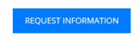

# Schnellstart-E-Mail-Vorlage {#quick-start-email-template}

Einige der Startprogramme in der Marketo Engage Reference Library enthalten eine einfache, benutzerfreundliche und anpassbare E-Mail-Vorlage, die die schnelle Erstellung von E-Mails in einer Reihe von Marketing-Anwendungsfällen ermöglicht.

Der Marketo Engage E-Mail-Editor verfügt über Funktionen, mit denen Sie das Layout Ihrer E-Mails ändern und deren Inhalt bearbeiten können.

* **Module**: In die Vorlage kodierte ziehbare/ablagefähige Inhaltsbausteine. Sie können neu organisiert und dupliziert werden.

* **Textelemente**: Mit dem Editor können Sie das Kopieren aktualisieren, Schriftstile ändern oder Links hinzufügen.

* **Bildelemente**: Ähnlich wie Textelemente können Bilder ausgetauscht, verknüpft und in der Größe geändert werden.

* **Variablen**: Wenn ein Modul ausgewählt ist, werden Variablen auf der rechten Seite des Editors angezeigt. Diese können verwendet werden, um Attribute des Moduls anzupassen, die nicht einfach über Bild- oder Textelemente bearbeitet werden können.

Wenden Sie sich für weitere Strategiehilfen oder Hilfe beim Anpassen eines Programms an das Adobe-Account-Team oder besuchen Sie die Seite [Adobe Professional Services](https://business.adobe.com/customers/consulting-services/main.html){target="_blank"} .

## Modulzusammenfassung {#modules-summary}

### Logo-Modul {#logo-module}

* Enthält ein Bildelement zum Aktualisieren des Logos
* Umfasst zu steuerende Variablen:
   * Oberer Abstand des Moduls
   * Unterer Abstand des Moduls
   * Hintergrundfarbe des Moduls
   * Ausrichtung des Logos
* 

### Bildmodul {#image-module}

* Enthält ein Bildelement zum Aktualisieren des Bildes
* Umfasst zu steuerende Variablen:
   * Oberer Abstand des Moduls
   * Unterer Abstand des Moduls
   * Hintergrundfarbe des Moduls
* 

### Überschriftenmodul {#headline-module}

* Enthält ein Textelement zum Aktualisieren der Überschrift
* Umfasst zu steuerende Variablen:
   * Oberer Abstand des Moduls
   * Unterer Abstand des Moduls
   * Hintergrundfarbe des Moduls
   * Schriftgröße der Überschrift (kann auch im Rich-Text-Editor bearbeitet werden)
   * Schriftfarbe der Überschrift (diese kann auch im Rich-Text-Editor bearbeitet werden)
   * Ausrichtung des Überschriftentextes (kann auch im Rich-Text-Editor bearbeitet werden)
* 

### Subheadline-Modul {#subheadline-module}

* Enthält ein Textelement zum Aktualisieren der Unterüberschrift
* Umfasst zu steuerende Variablen:
   * Oberer Abstand des Moduls
   * Unterer Abstand des Moduls
   * Hintergrundfarbe des Moduls
   * Schriftgröße der Unterüberschrift (kann auch im Rich-Text-Editor bearbeitet werden)
   * Schriftfarbe der Unterüberschrift (kann auch im Rich-Text-Editor bearbeitet werden)
   * Ausrichtung des Unterüberschriftentextes (kann auch im Rich-Text-Editor bearbeitet werden)
* 

### Kostenloses Textmodul {#free-text-module}

* Enthält ein Textelement zum Aktualisieren des Texts
* Umfasst zu steuerende Variablen:
   * Oberer Abstand des Moduls
   * Unterer Abstand des Moduls
   * Hintergrundfarbe des Moduls
   * Schriftgröße des Textes (kann auch im Rich-Text-Editor bearbeitet werden)
   * Schriftfarbe des Textes (kann auch im Rich-Text-Editor bearbeitet werden)
   * Ausrichtung des Texts (kann auch im Rich-Text-Editor bearbeitet werden)
* 

### CTA-Modul {#cta-module}

* Umfasst zu steuerende Variablen:
   * Oberer Abstand des Moduls
   * Unterer Abstand des Moduls
   * Hintergrundfarbe des Moduls
   * CTA-Textfarbe
   * CTA-Hintergrundfarbe
   * CTA-Rahmenfarbe
   * CTA-Rahmenradius (um die Schaltflächen zu runden - **Hinweis**: Diese Funktion funktioniert nicht in Microsoft Outlook-E-Mail-Clients)
   * CTA-URL
   * CTA-Text
   * CTA-Ausrichtung
* 

### Divider Module {#divider-module}

* Umfasst zu steuerende Variablen:
   * Oberer Abstand des Moduls
   * Unterer Abstand des Moduls
   * Hintergrundfarbe des Moduls
   * Trennfarbe
   * Trennhöhe (in Pixel)
   * Trennbreite (in %)
* 

### Fußzeilenmodul {#footer-module}

* Textelement, das zum Austauschen oder Verknüpfen von Social-Symbolen verwendet werden kann
* Textelement zum Aktualisieren der Fußzeilensprache
* Umfasst zu steuerende Variablen:
   * Oberer Abstand des Moduls
   * Unterer Abstand des Moduls
   * Hintergrundfarbe des Moduls
   * Textfarbe
   * Inhaltsausrichtung
* 
