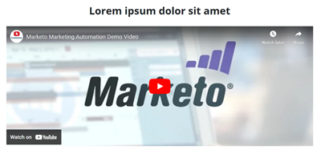

# Schnellstart-Landingpage-Vorlage {#quick-start-landing-page-template}

Einige der Startprogramme in der Marketo Engage Reference Library enthalten eine einfache, benutzerfreundliche und anpassbare Landingpage-Vorlage, die die schnelle Erstellung von Landingpages in einer Reihe von Marketing-Anwendungsfällen ermöglicht.

>[!TIP]
>
>Weitere Informationen [Geführte Landingpage-Vorlagen](/help/marketo/product-docs/demand-generation/landing-pages/landing-page-templates/create-a-guided-landing-page-template.md){target="_blank"}

Weitere Hilfe zur Strategie oder Hilfe bei der Anpassung eines Programms erhalten Sie vom Adobe-Account-Team oder unter [Adobe Professional Services](https://business.adobe.com/customers/consulting-services/main.html){target="_blank"} Seite.

## Bereichszusammenfassung {#sections-summary}

### Logo-Bereich {#logo-section}

* Umfasst Bildelement zum Austauschen des Logos gegen ein anderes Bild
* Umfasst zu bearbeitende Variablen:
   * Logogröße
   * Logo-Ausrichtung
   * Hintergrundfarbe für den Logo-Bereich
   * Bereich ein- oder ausblenden
   * Auffüllung oben im Abschnitt
   * Unterer Abstand des Abschnitts
* 

### Bildabschnitt {#image-section}

* Umfasst Bildelement zum Austauschen des Logos gegen ein anderes Bild
* Umfasst zu bearbeitende Variablen:
   * Link zum Bannerbild
   * Die Bannerbreite - eine der Schalter unten rechts ermöglicht es Ihnen, das Bild entweder auf die Breite des Inhalts-Containers oder auf die Breite des gesamten Browsers auszurichten
   * Bereich ein- oder ausblenden
* 

### 2-Spalten-Text links, Formular rechts {#two-col-left-form-right}

* Überschriftentextelement zum Aktualisieren der Überschriftenkopie
* Absatztext-Element zum Aktualisieren der Absatzkopie
* Formularelement zum Hinzufügen in einem Formular
* Textelement unter dem Formular zum Bearbeiten des Textes und der Links für Datenschutzrichtlinien
* Zu bearbeitende Variablen: Hintergrundfarbe für Abschnitt
   * Hintergrundfarbe direkt hinter dem Formular
   * Rahmenradius für Formularumrandungen (dadurch, dass sie gekrümmte Ecken haben oder, falls auf &quot;0&quot;gesetzt, von Ecken quadrieren)
   * Anzeigen oder Ausblenden des gesamten Abschnitts
   * Ein- oder Ausblenden des Formulars (Ausblenden des Formulars) bewirkt, dass der Text in der linken Spalte die Breite der Seite ausfüllt. Dies kann für eine Dankeseite oder Bestätigungsseite verwendet werden, auf der kein Formular vorhanden ist.)
   * Datenschutz-Richtlinientext ein- oder ausblenden
* 

### Videoabschnitt {#video-section}

* Textelement zum Aktualisieren des Überschriftentextes
* Zu bearbeitende Variablen:
   * Hintergrundfarbe für Abschnitt
   * Einbettungscode für Video
   * Videoüberschrift einblenden/ausblenden
   * Video ein-/ausblenden
* 

### Fußzeilenbereich {#footer-section}

* Textelement zum Bearbeiten des Inhalts in der linken Spalte
* Textelement zum Aktualisieren der Social-Symbole (Symbole verwenden die Schriftart FontAwesome anstelle von Bildern, können aber durch Bilder ersetzt werden).
* Zu bearbeitende Variablen:
   * Hintergrundfarbe für Abschnitt
   * Farbe für Social-Symbole
   * Bereich einblenden/ausblenden
* 

### Zusätzliche Variablen {#additional-variables}

* **Schaltflächenrahmenradius**: passt die Formularschaltfläche an, um sie zu runden oder rechteckig zu sein.
* **Schaltflächenfarbe**: aktualisiert die Farbe der Schaltfläche im Formular
* **Farbe für Schaltflächen-Mauszeiger**: ändert die Farbe des Hover-Status für die Schaltfläche im Formular
* **Linkfarbe**: aktualisiert die Farbe von Links auf der gesamten Seite.
* **Abstand am oberen Rand**: fügt über jedem Abschnitt mit Ausnahme des Logo-Bereichs Platz hinzu.
* **Abstand unten**: fügt unterhalb jedes Abschnitts mit Ausnahme des Bereichs Logos Platz hinzu.
