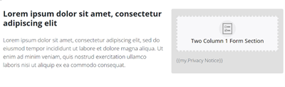

# Schnellstart-Landingpage-Vorlage {#quick-start-landing-page-template}

Einige der Einstiegsprogramme in der Marketo Engage-Referenzbibliothek enthalten eine einfache, benutzerfreundliche und anpassbare Landingpage-Vorlage, mit der Landingpages in einer Reihe von Marketing-Anwendungsfällen schnell erstellt werden können.

>[!TIP]
>
>Weitere Informationen zu [Geführte Landingpage-Vorlagen](/help/marketo/product-docs/demand-generation/landing-pages/landing-page-templates/create-a-guided-landing-page-template.md){target="_blank"}

Wenden Sie sich an das Adobe-Accountteam oder besuchen Sie die Seite [Adobe Professional Services](https://business.adobe.com/customers/consulting-services/main.html){target="_blank"}, um weitere Unterstützung bei der Strategie oder bei der Anpassung eines Programms zu erhalten.

## Zusammenfassung der Abschnitte {#sections-summary}

### Logo-Bereich {#logo-section}

* Enthält ein Bildelement, um das Logo gegen ein anderes Bild auszutauschen
* Enthält zu bearbeitende Variablen:
   * Logo-Größe
   * Logo-Ausrichtung
   * Hintergrundfarbe für den Logoabschnitt
   * Ein- oder Ausblenden des Abschnitts
   * Oberer Abstand des Abschnitts
   * Unterer Abstand des Abschnitts
* 

### Bildausschnitt {#image-section}

* Enthält ein Bildelement, um das Logo gegen ein anderes Bild auszutauschen
* Enthält zu bearbeitende Variablen:
   * Der Link zum Bannerbild
   * Die Bannerbreite - einer der Schalter unten rechts ermöglicht es Ihnen, das Bild entweder als Breite des Inhalts-Containers oder als Breite des gesamten Browsers festzulegen
   * Ein- oder Ausblenden des Abschnitts
* 

### 2-spaltiger Text links, Formular rechts {#two-col-left-form-right}

* Überschriftentextelement zur Aktualisierung der Überschriftenkopie
* Absatztextelement zur Aktualisierung der Absatzkopie
* Formularelement, das einem Formular hinzugefügt werden soll
* Textelement unter dem Formular zum Bearbeiten von Text und Links für Datenschutzrichtlinien
* Zu bearbeitende Variablen:
Hintergrundfarbe für Abschnitt
   * Hintergrundfarbe direkt hinter dem Formular
   * Rahmenradius für das Feld um das Formular (sodass es gekrümmte Ecken hat oder, falls auf „0“ eingestellt, quadratische Ecken)
   * Ein- oder Ausblenden des gesamten Abschnitts
   * Ein- oder Ausblenden des Formulars (das Ausblenden des Formulars bewirkt, dass der Text in der linken Spalte die Seitenbreite ausfüllt). Dies kann für eine Danksagungs- oder Bestätigungsseite verwendet werden, auf der kein Formular vorhanden ist.)
   * Ein- oder Ausblenden des Datenschutzrichtlinientextes
* 

### Videoabschnitt {#video-section}

* Textelement zum Aktualisieren des Überschrifttexts
* Zu bearbeitende Variablen:
   * Hintergrundfarbe für Abschnitt
   * Video-Einbettungs-Code
   * Video-Überschrift ein-/ausblenden
   * Video ein-/ausblenden
* 

### Fußzeilenabschnitt {#footer-section}

* Textelement zum Bearbeiten des Inhalts in der linken Spalte
* Textelement zum Aktualisieren der Social-Media-Symbole (Symbole verwenden die FontAwesome-Schriftart anstelle von Bildern, können jedoch durch Bilder ersetzt werden).
* Zu bearbeitende Variablen:
   * Hintergrundfarbe für Abschnitt
   * Social-Media-Symbolfarbe
   * Abschnitt ein-/ausblenden
* 

### Zusätzliche Variablen {#additional-variables}

* **Rahmenradius der Schaltfläche**: Passt die Formularschaltfläche entweder gerundet oder rechteckig an
* **Schaltflächenfarbe**: Aktualisiert die Farbe der Schaltfläche im Formular
* **Hover-Farbe für Schaltfläche**: Ändert die Farbe des Hover-Status für die Schaltfläche auf dem Formular
* **Link-Farbe**: Aktualisiert die Farbe der Links auf der gesamten Seite
* **Abschnittsoberer Abstand**: Fügt über jedem Abschnitt mit Ausnahme des Logoabschnitts Leerzeichen hinzu.
* **Abschnitt Abstand unten**: Fügt unterhalb jedes Abschnitts mit Ausnahme des Abschnitts „Logos“ Leerzeichen hinzu
