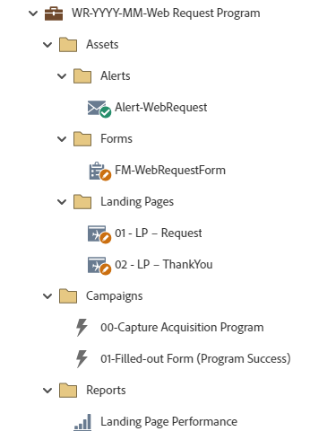

# WR-YYYY-MM-Web-Anfrage-Programm {#wr-yyyy-mm-web-request-program}

Dies ist ein Beispielprogramm, das sich ideal für Formulare für Kontaktanfragen, Angebotsanfragen, Demoanfragen oder Testanfragen eignet, bei denen ein Standardprogramm von Marketo Engage verwendet wird. Kann mit Marketo-Landingpages oder als eingebettetes Formular auf Landingpages verwendet werden, bei denen es sich nicht um Marketo handelt. Bei der Übermittlung eines Formulars wird eine Benachrichtigungs-E-Mail an eine bestimmte Person gesendet.

Wenden Sie sich an das Adobe-Accountteam oder besuchen Sie die Seite [Adobe Professional Services](https://business.adobe.com/customers/consulting-services/main.html){target="_blank"}, um weitere Unterstützung bei der Strategie oder bei der Anpassung eines Programms zu erhalten.

## Kanal-Zusammenfassung {#channel-summary}

<table style="table-layout:auto">
 <tbody>
  <tr>
   <th>Kanal</th>
   <th>Mitgliedschaftsstatus</th>
   <th>Analytics Behavior</th>
   <th>Programmtyp</th>
  </tr>
  <tr>
   <td>Web-Anforderung</td>
   <td>01 - Interagiert - Erfolg</td>
   <td>Einschließlich</td>
   <td>Standard</td>
  </tr>
 </tbody>
</table>

## Programm enthält die folgenden Assets {#program-contains-the-following-assets}

<table style="table-layout:auto">
 <tbody>
  <tr>
   <th>Typ</th>
   <th>Vorlagenname</th>
   <th>Asset-Name</th>
  </tr>
  <tr>
   <td>Formular</td>
   <td> </td>
   <td>FM-WebRequestForm</td>
  </tr>
  <tr>
   <td>E-Mail</td>
   <td><a href="/help/marketo/product-docs/core-marketo-concepts/programs/program-library/quick-start-email-template.md" target="_blank">Schnellstart-E-Mail-Vorlage</a></td>
   <td>alert-webRequest</td>
  </tr>
  <tr>
   <td>Landingpage</td>
   <td><a href="/help/marketo/product-docs/core-marketo-concepts/programs/program-library/quick-start-landing-page-template.md" target="_blank">Schnellstart-LP-Vorlage</a></td>
   <td>01 - LP - Anfrage</td>
  </tr>
  <tr>
   <td>Landingpage</td>
   <td><a href="/help/marketo/product-docs/core-marketo-concepts/programs/program-library/quick-start-landing-page-template.md" target="_blank">Schnellstart-LP-Vorlage</a></td>
   <td>02 - LP - Danke</td>
  </tr>
  <tr>
   <td>Lokaler Bericht</td>
   <td> </td>
   <td>Landing Page-Leistung</td>
  </tr>
   <tr>
   <td>Intelligente Kampagne</td>
   <td> </td>
   <td>Neue Person aus Web-Anfrage</td>
  </tr>
   <tr>
   <td>Intelligente Kampagne</td>
   <td> </td>
   <td>Neue Person aus Webinar</td>
  </tr>
  <tr>
   <td>Ordner</td>
   <td> </td>
   <td>Assets - enthält alle Kreativ-Assets
 (Unterordner für Warnhinweise und Landingpages)</td>
  </tr>
  <tr>
   <td>Ordner</td>
   <td> </td>
   <td>Kampagnen - Alle intelligenten Kampagnen werden gespeichert</td>
  </tr>
  <tr>
   <td>Ordner</td>
   <td> </td>
   <td>Berichte</td>
  </tr>
 </tbody>
</table>

## Meine Token enthalten {#my-tokens-included}

<table style="table-layout:auto">
 <tbody>
  <tr>
   <th>Token-Typ</th>
   <th>Token-Name</th>
   <th>Wert</th>
  </tr>
  <tr>
   <td>Text</td>
   <td><code>{{my.Request-Type}}</code></td>
   <td>So erreichen Sie uns</td>
  </tr>
  <tr>
   <td>Text</td>
   <td><code>{{my.ALERT-FromAddress}}</code></td>
   <td>PlaceholderFrom.email@mydomain.com</td>
  </tr>
  <tr>
   <td>Text</td>
   <td><code>{{my.ALERT-FromName}}</code></td>
   <td><code><--My From Name Here--></code></td>
  </tr>
  <tr>
   <td>Text</td>
   <td><code>{{my.ALERT-ReplyToAddress}}</code></td>
   <td>reply-to.email@mydomain.com</td>
  </tr>
  <tr>
   <td>Text</td>
   <td><code>{{my.PageURL-ThankYou}}</code></td>
   <td>My.DankePageURL?ohne die http://</td>
  </tr>
 </tbody>
</table>

## Kollisionsregeln {#conflict-rules}

* **Programm-Tags**
   * Tags in diesem Abonnement erstellen - _Empfohlen_
   * Ignorieren

* **Landingpage-Vorlage mit demselben Namen**
   * Originalvorlage kopieren
   * Zielvorlage verwenden - _Empfohlen_

* **Bilder mit demselben Namen**
   * Beide Dateien beibehalten
   * Element in diesem Abonnement ersetzen - _Empfohlen_

* **E-Mail-Vorlagen mit demselben Namen**
   * Beide Vorlagen beibehalten
   * Vorhandene Vorlage ersetzen - _Empfohlen_

## Bewährte Methoden {#best-practices}

* Verschieben Sie das Formular nach dem Import des Webinar-Programms von einem lokalen Asset in ein globales Asset im Design Studio.
   * Das Verringern der Anzahl von Formularen und die Verwendung von mehr globalen Assets aus dem Design Studio ermöglicht mehr Skalierbarkeit in Ihrem Programmdesign und der administrativen Governance. Es bietet außerdem Flexibilität für regelmäßige Compliance-Aktualisierungen für Felder, Opt-in-Sprache usw.

* Erwägen Sie, die Vorlagen in Ihrem importierten Programm zu aktualisieren, um die aktuellen Markenvorlagen zu verwenden, oder aktualisieren Sie die neu importierte Vorlage, um Ihre Marke widerzuspiegeln, indem Sie einen Ausschnitt oder Ihre entsprechenden Logo-/Fußzeileninformationen hinzufügen.

* Erwägen Sie, die Namenskonvention dieses Programmbeispiels zu aktualisieren, um sie an Ihre Namenskonvention anzupassen.

>[!NOTE]
>
>Denken Sie daran, die Werte für Mein Token in der Programmvorlage und jedes Mal, wenn Sie das Programm verwenden, nach Bedarf zu aktualisieren.

>[!IMPORTANT]
>
>Meine Token, die auf eine URL verweisen, dürfen die URL http:// oder https:// nicht enthalten. Andernfalls funktioniert der Link innerhalb des Assets nicht ordnungsgemäß.
