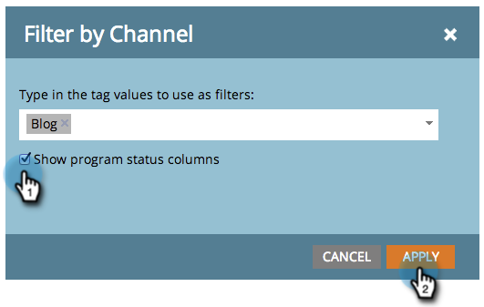

# Hinzufügen von Programmstatusspalten zu einem Programmbericht {#add-program-status-columns-to-a-program-report}

Fügen Sie Statistiken zum Programmstatus zu Ihrem [Programmvollzugsbericht](/help/marketo/product-docs/core-marketo-concepts/programs/program-performance-report/create-a-program-performance-report.md).

1. Wechseln Sie zu Marketingaktivitäten (oder Analytics).

   

1. Wählen Sie Ihren Bericht aus.

   

1. Klicken Sie auf **Einrichtung** und ziehen Sie über das Kanal -Tag.

   

1. Wählen Sie einen Kanal aus, nach dem gefiltert werden soll.

   

   >[!TIP]
   >
   >Um Spalten mit dem Programmstatus anzuzeigen, muss Ihr Bericht nach _Nur eins_ -Kanal.

1. Aktivieren Sie die Option Spalten mit Programmstatus anzeigen . Klicks **Anwenden**.

   

1. Du hast es getan! Klicken Sie auf den Tab Bericht , um Ihren Bericht mit den Spalten zum Programmstatus anzuzeigen.

   

>[!NOTE]
>
>Wenn für jeden Status im Programm keine Spalte angezeigt wird, stellen Sie sicher, dass Sie [die anzuzeigenden Spalten ausgewählt haben](/help/marketo/product-docs/reporting/basic-reporting/editing-reports/select-report-columns.md) in den Bericht ein.

>[!MORELIKETHIS]
>
>[Filtern eines Programmberichts nach Tag](/help/marketo/product-docs/core-marketo-concepts/programs/program-performance-report/filter-a-program-report-by-tag.md)
