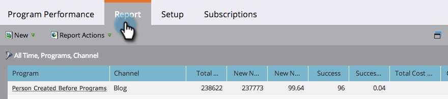

# hinzufügen Programm-Statusspalten zu einem Programm-Bericht {#add-program-status-columns-to-a-program-report}

hinzufügen Statistik zum Programm-Status Ihres [Programm-Leistungsberichts](/help/marketo/product-docs/core-marketo-concepts/programs/program-performance-report/create-a-program-performance-report.md).

1. Gehen Sie zu Marketing-Aktivitäten (oder Analytics).

   

1. Wählen Sie Ihren Bericht aus.

   

1. Klicken Sie auf die Registerkarte **Setup** und ziehen Sie über das Kanal-Tag.

   

1. Wählen Sie einen Kanal zum Filtern aus.

   

   >[!TIP]
   >
   >Um Statusspalten des Programms anzuzeigen, muss Ihr Bericht nach _nur einem_-Kanal gefiltert werden.

1. Aktivieren Sie die Option Programm-Statusspalten anzeigen. Klicken Sie auf **Apply**.

   

1. Du hast es getan! Klicken Sie auf die Registerkarte Bericht, um Ihren Bericht mit den Statusspalten des Programms anzuzeigen.

   

>[!NOTE]
>
>Wenn für jeden Status im Programm keine Spalte angezeigt wird, stellen Sie sicher, dass Sie die Spalten [ausgewählt haben, die im Bericht &quot;](/help/marketo/product-docs/reporting/basic-reporting/editing-reports/select-report-columns.md)&quot;angezeigt werden sollen.

>[!MORELIKETHIS]
>
>[Programm-Bericht nach Tag filtern](/help/marketo/product-docs/core-marketo-concepts/programs/program-performance-report/filter-a-program-report-by-tag.md)
