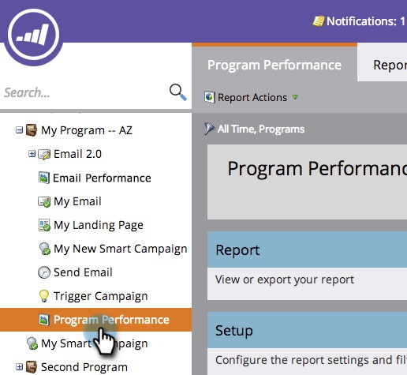

# Hinzufügen von Programmstatusspalten zu einem Programmbericht {#add-program-status-columns-to-a-program-report}

Fügen Sie Ihrem [Programmleistungsbericht](/help/marketo/product-docs/core-marketo-concepts/programs/program-performance-report/create-a-program-performance-report.md){target="_blank"} Statistiken zum Programmstatus hinzu.

1. Wechseln Sie zu **[!UICONTROL Marketingaktivitäten]** (oder **[!UICONTROL Analytics]**).

   

1. Wählen Sie Ihren Bericht aus.

   

1. Klicken Sie auf die Registerkarte **[!UICONTROL Einrichtung]** und ziehen Sie über das Tag **[!UICONTROL Kanal]**.

   

1. Wählen Sie einen Kanal aus, nach dem gefiltert werden soll.

   

   >[!TIP]
   >
   >Um Spalten mit dem Programmstatus anzuzeigen, muss Ihr Bericht nach _nur einem_ -Kanal gefiltert werden.

1. Aktivieren Sie die Option Spalten mit Programmstatus anzeigen . Klicken Sie auf **[!UICONTROL Anwenden]**.

   

1. Du hast es getan! Klicken Sie auf die Registerkarte [!UICONTROL Bericht] , um Ihren Bericht mit den Spalten zum Programmstatus anzuzeigen.

   

>[!NOTE]
>
>Wenn nicht für jeden Status im Programm eine Spalte angezeigt wird, vergewissern Sie sich, dass Sie die Spalten mit [ausgewählt haben, um ](/help/marketo/product-docs/reporting/basic-reporting/editing-reports/select-report-columns.md){target="_blank"} im Bericht anzuzeigen.

>[!MORELIKETHIS]
>
>[Filtern eines Programmberichts nach Tag](/help/marketo/product-docs/core-marketo-concepts/programs/program-performance-report/filter-a-program-report-by-tag.md){target="_blank"}
