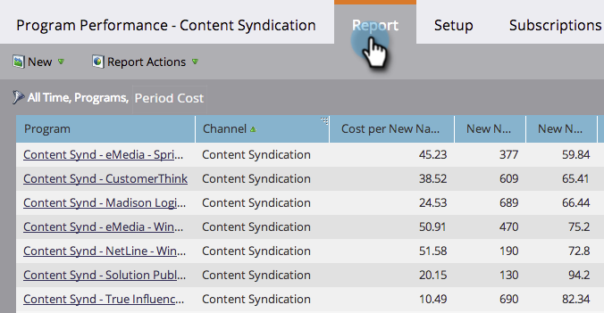

# Filtern eines Programm-Berichts nach Zeitkosten {#filter-a-program-report-by-period-cost}

Konzentrieren Sie den [Programm Performance Report](/help/marketo/product-docs/core-marketo-concepts/programs/program-performance-report/create-a-program-performance-report.md) auf einen bestimmten Zeitraumkostenzeitrahmen.

1. Gehen Sie zu **Marketing-Aktivitäten** (oder **Analytics**).

   

1. Wählen Sie Ihren Programm-Leistungsbericht aus.

   

1. Klicken Sie auf die Registerkarte **Setup** und ziehen Sie den Mauszeiger über **Kosten des Zeitraums**.

   

1. Geben Sie für die angefallenen Kosten die Datumsangaben **Von** und **bis** ein und klicken Sie auf **Übernehmen**.

   

1. Du bist fertig! Klicken Sie auf die Registerkarte **Bericht**, um nur die Programm anzuzeigen, die innerhalb des angegebenen Zeitraums liegen.

   

   >[!NOTE]
   >
   >[Programm-Bericht nach Programm filtern](/help/marketo/product-docs/core-marketo-concepts/programs/program-performance-report/filter-a-program-report-by-program.md)
