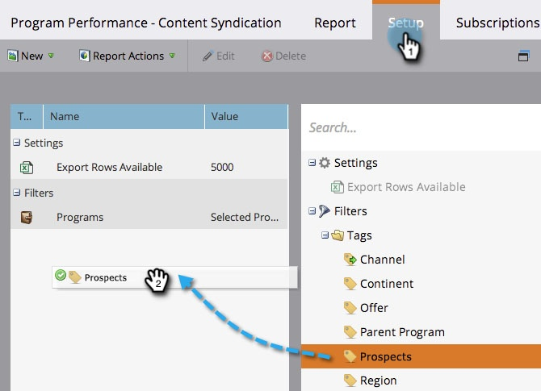

# Filtern eines Programmberichts nach Tag {#filter-a-program-report-by-tag}

Fokus [Programmvollzugsbericht](/help/marketo/product-docs/core-marketo-concepts/programs/program-performance-report/create-a-program-performance-report.md) spezifische [tags](/help/marketo/product-docs/core-marketo-concepts/programs/working-with-programs/understanding-tags.md){target="_blank"}.

1. Navigieren Sie zu **[!UICONTROL Marketingaktivitäten]** (oder **[!UICONTROL Analytics]**).

   

1. Wählen Sie **[!UICONTROL Programmleistung]** Bericht.

   

1. Klicken Sie auf **[!UICONTROL Einrichtung]** und ziehen Sie über einen der **[!UICONTROL Tags]** Filter.

   

1. Wählen Sie die Tag-Werte aus, die in Ihren Bericht aufgenommen werden sollen.

   

1. Klicks **[!UICONTROL Anwenden]**.

   

1. Abgeschlossen! Klicken Sie auf **[!UICONTROL Bericht]** Registerkarte anzuzeigen _just_ die Programme, die den ausgewählten Tags in Ihrem Bericht entsprechen.

   

>[!NOTE]
>
>[Filtern eines Programmberichts nach Periodenkosten](/help/marketo/product-docs/core-marketo-concepts/programs/program-performance-report/filter-a-program-report-by-period-cost.md){target="_blank"}
