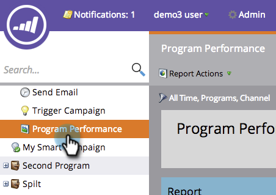
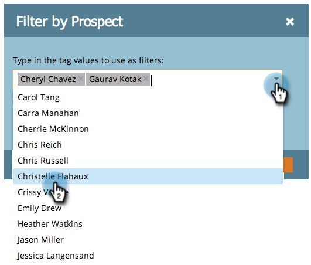
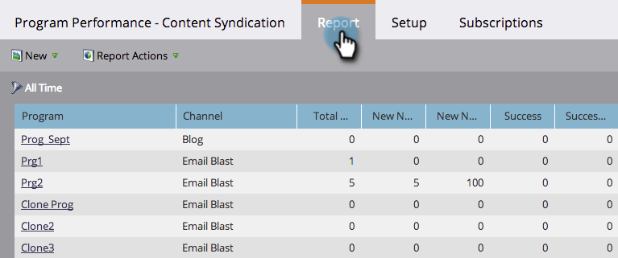

# Filtern eines Programmberichts nach Tags {#filter-a-program-report-by-tag}

Konzentrieren Sie Ihren [Programmleistungsbericht](/help/marketo/product-docs/core-marketo-concepts/programs/program-performance-report/create-a-program-performance-report.md) auf bestimmte [Tags](/help/marketo/product-docs/core-marketo-concepts/programs/working-with-programs/understanding-tags.md){target="_blank"}.

1. Navigieren Sie **[!UICONTROL Marketing-Aktivitäten]** (oder **[!UICONTROL Analytics]**).

   

1. Wählen Sie Ihren **[!UICONTROL Programmleistung]**-Bericht aus.

   

1. Klicken Sie auf **[!UICONTROL Setup]** und ziehen Sie per Drag-and-Drop über einen der **[!UICONTROL Tags]** Filter.

   

1. Wählen Sie die Tag-Werte aus, die in Ihren Bericht aufgenommen werden sollen.

   

1. Klicken Sie auf **[!UICONTROL Übernehmen]**.

   

1. Fertig! Klicken Sie auf **[!UICONTROL Bericht]**, um _nur_ die Programme anzuzeigen, die den ausgewählten Tags in Ihrem Bericht entsprechen.

   

>[!NOTE]
>
>[Filtern Sie einen Programmbericht nach Periodenkosten](/help/marketo/product-docs/core-marketo-concepts/programs/program-performance-report/filter-a-program-report-by-period-cost.md){target="_blank"}
