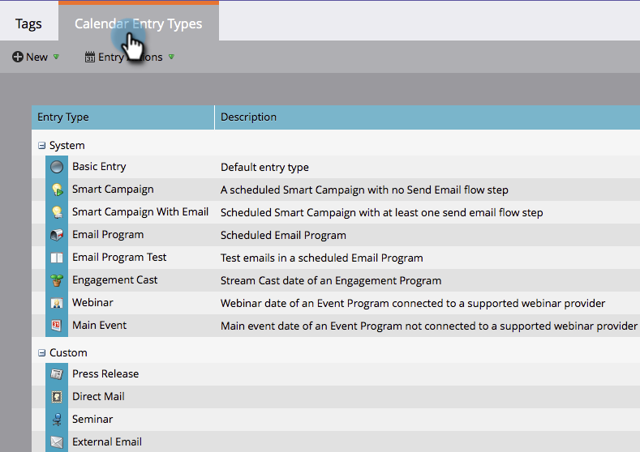

# Erstellen benutzerdefinierter Eintragstypen {#create-custom-entry-types}

Sie können benutzerdefinierte Eintragstypen erstellen, um sie in Ihrer Programmplanansicht zu verwenden. Auf diese Weise können Sie alle Tagesordnungspunkte verfolgen, die nicht von Marketo stammen und sich auf Ihr Programm auswirken.

1. Gehen Sie zum Abschnitt **[!UICONTROL Admin]** und klicken Sie auf **[!UICONTROL Tags]**.

   

1. Klicken Sie **[!UICONTROL Kalendereintragstyp]**.

   

1. Klicken Sie auf **[!UICONTROL Neu]** und wählen Sie **[!UICONTROL Eintragstyp]**.

   

1. Benennen Sie Ihren Eintrag und wählen Sie ein Symbol aus.

   

1. Wählen Sie eine **[!UICONTROL Eintragsfarbe]** aus.

   

1. Klicken Sie auf **[!UICONTROL Speichern]**.

   

Sehr gut! Wenn Sie jetzt einen neuen Eintrag in Ihrer Zeitplanansicht erstellen, ist dieser Typ eine Option.

>[!NOTE]
>
>Sie können bis zu 100 benutzerdefinierte Eintragstypen erstellen.
