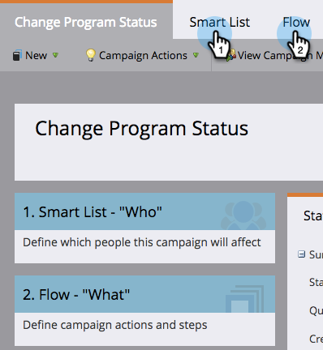

# Erstellen einer intelligenten Stapel-Kampagne in der Ansicht „Programmplanung“ {#creating-a-batch-smart-campaign-in-the-program-schedule-view}

Sie können in Ihrem Programm in der Ansicht [Programmzeitplan“ neue Smart](/help/marketo/product-docs/core-marketo-concepts/programs/program-schedule-view/rerun-a-smart-campaign-in-the-program-schedule-view.md){target="_blank"}Kampagnen erstellen und vorhandene erneut ausführen.

>[!NOTE]
>
>In dieser Ansicht können nur Batch-Kampagnen erstellt werden. Trigger-Kampagnen werden nicht unterstützt.

1. Wählen Sie das Datum aus, an dem Ihre neue intelligente Kampagne ausgeführt werden soll.

   

1. Wählen Sie einen Namen für Ihren Eintrag, der Ihre neue Smart-Kampagne wird. Drücken Sie die **[!UICONTROL Eingabetaste]**, um den Namen zu bestätigen.

   

1. Klicken Sie auf **[!UICONTROL Typ]** und wählen Sie **[!UICONTROL Smart-Kampagne]**.

   

   >[!NOTE]
   >
   >Sie können auch eine vorhandene Smart-Kampagne ausführen, indem Sie sie aus der Dropdown-Liste auswählen.

   

1. Wählen Sie Ihre Regeln [Smart Campaign](/help/marketo/product-docs/core-marketo-concepts/smart-campaigns/creating-a-smart-campaign/create-a-new-smart-campaign.md){target="_blank"} aus.

   

1. Diese Smart-Kampagne wird nun wie in der Zeitplanansicht und in den Eintragsdetails bestätigt angezeigt.

   

Dadurch wird eine neue Smart Campaign-Ausführung in Ihrem Programm erstellt.
