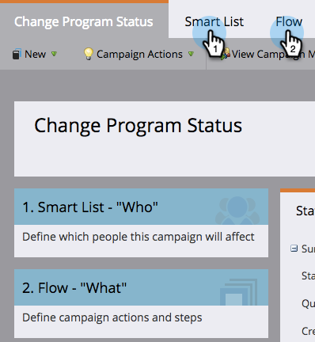

# Erstellen einer Smart-Batch-Kampagne in der Programmplanansicht {#creating-a-batch-smart-campaign-in-the-program-schedule-view}

Sie können neue Smart-Kampagnen erstellen und [Bestehende Elemente erneut ausführen](/help/marketo/product-docs/core-marketo-concepts/programs/program-schedule-view/rerun-a-smart-campaign-in-the-program-schedule-view.md) in Ihrem Programm aus der Programmplanungsansicht.

>[!NOTE]
>
>In dieser Ansicht können nur Batch-Smart-Kampagnen erstellt werden. Trigger-Kampagnen werden nicht unterstützt.

1. Wählen Sie das Datum aus, an dem Ihre neue Smart-Kampagne laufen soll.

   

1. Wählen Sie einen Namen für Ihren Eintrag aus, der zu Ihrer neuen Smart-Kampagne wird. Drücken Sie die **Eingabe/Rückgabe** zum Bestätigen des Namens.

   

1. Klicken Sie auf **Typ** und wählen Sie **Smart Campaign**.

   

   >[!NOTE]
   >
   >Sie können auch eine vorhandene Smart-Kampagne ausführen, indem Sie sie aus der Dropdown-Liste auswählen.

   

1. Wählen Sie [Smart-Kampagne](/help/marketo/product-docs/core-marketo-concepts/smart-campaigns/creating-a-smart-campaign/create-a-new-smart-campaign.md) Regeln.

   

1. Diese intelligente Kampagne wird jetzt in der Planungsansicht und in den Einstiegsdetails bestätigt.

   

Dadurch wird eine neue Smart-Kampagne in Ihrem Programm erstellt.
