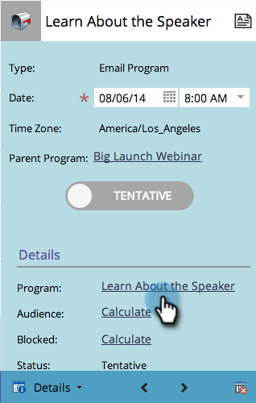

# Erstellen eines neuen E-Mail-Programms in der Planansicht {#creating-a-new-email-program-in-the-schedule-view}

Sie können ein E-Mail-Programm in der Programmplanungsansicht erstellen. So geht es.

1. Navigieren Sie zu **[!UICONTROL Marketingaktivitäten]**.

   

1. Wählen Sie Ihr Programm aus.

   

1. Wählen Sie das Datum aus, an dem Ihr E-Mail-Programm ausgeführt werden soll.

   

1. Namen eingeben. Auswählen **[!UICONTROL Email Program]**.

   

1. Klicken Sie in den Details auf den Link zu Ihrem neuen E-Mail-Programm.

   

1. [E-Mail-Programm einrichten](/help/marketo/product-docs/email-marketing/email-programs/creating-an-email-program/create-an-email-program.md){target="_blank"} und klicken **[!UICONTROL Programm genehmigen]**.

   

   Neben dem detaillierten Dashboard bietet die Verwendung eines [Email-Programm](/help/marketo/product-docs/email-marketing/email-programs/creating-an-email-program/understanding-email-programs.md){target="_blank"} instead of a smart campaign is the ability to easily implement an [A/B test](/help/marketo/product-docs/email-marketing/email-programs/email-program-actions/email-test-a-b-test/add-an-a-b-test.md){target="_blank"}. Viel Spaß!
