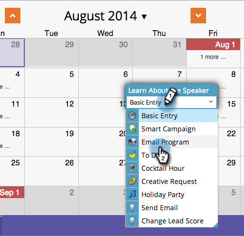

# Erstellen eines neuen E-Mail-Programms in der Zeitplanansicht {#creating-a-new-email-program-in-the-schedule-view}

Sie können ein E-Mail-Programm in der Ansicht Programmplan erstellen. Und so geht das.

1. Navigieren Sie zu **[!UICONTROL Marketing-Aktivitäten]**.

   

1. Wählen Sie Ihr Programm.

   

1. Wählen Sie das Datum aus, an dem Ihr E-Mail-Programm ausgeführt werden soll.

   

1. Geben Sie einen Namen ein. Wählen Sie **[!UICONTROL E-Mail-Programm]** aus.

   

1. Klicken Sie in den Eintragsdetails auf den Link zu Ihrem neuen E-Mail-Programm.

   

1. [Richten Sie Ihr E-Mail-Programm &#x200B;](/help/marketo/product-docs/email-marketing/email-programs/creating-an-email-program/create-an-email-program.md){target="_blank"} und klicken Sie auf **[!UICONTROL Programm genehmigen]**.

   

   Neben dem detaillierten Dashboard bietet die Verwendung eines [E-Mail](/help/marketo/product-docs/email-marketing/email-programs/creating-an-email-program/understanding-email-programs.md){target="_blank"}Programms anstelle einer intelligenten Kampagne die Möglichkeit, einfach einen A/B[Test zu &#x200B;](/help/marketo/product-docs/email-marketing/email-programs/email-program-actions/email-test-a-b-test/add-an-a-b-test.md){target="_blank"}. Viel Spaß!
