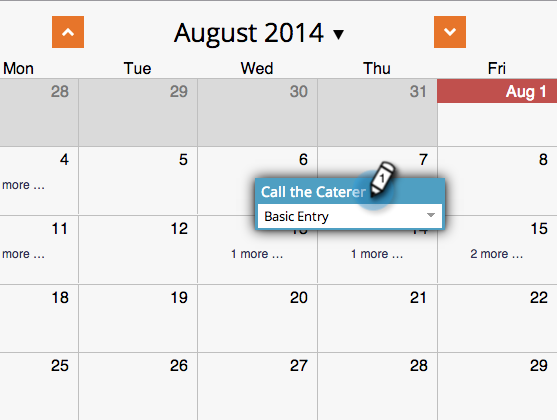

# Erstellen eines Eintrags in der Programmplanansicht {#creating-an-entry-in-the-program-schedule-view}

Sie können in der Programmplanungsansicht Einträge erstellen, um ein bestehendes Programm zu ergänzen.

## Erstellen eines einfachen Eintrags {#create-a-basic-entry}

1. Navigieren Sie zu **[!UICONTROL Marketingaktivitäten]**.

   

1. Wählen Sie Ihr Programm aus. Klicken Sie auf **[!UICONTROL Ansicht]** angezeigt. Auswählen **[!UICONTROL Zeitplan]**.

   

1. Klicken Sie auf einen Tag, um den Eintrag hinzuzufügen.

   

1. Benennen Sie den Eintrag. Presse **[!UICONTROL Eingabe]** um den Namen zu bestätigen.

   

1. Wählen Sie das Start- und Enddatum/-uhrzeit für Ihren neuen Eintrag aus.

   

1. Klicken Sie auf das Beschreibungssymbol, um weitere Informationen hinzuzufügen.

   

1. Geben Sie Ihre Beschreibung ein und klicken Sie auf **[!UICONTROL Speichern]**.

   

1. Bewegen Sie den Mauszeiger über das Beschreibungssymbol, um die Beschreibung der Einsendung anzuzeigen.

   

## Eintragstyp ändern {#change-entry-type}

1. Wählen Sie einen einfachen Eintrag aus dem **[!UICONTROL Agenda]** anzeigen.

   

1. Wählen Sie die **[!UICONTROL Typ]** angezeigt. Wählen Sie einen neuen Eintragstyp aus.

   >[!NOTE]
   >
   >Aufgabenstellung ist eine [benutzerdefinierter Eintrag](/help/marketo/product-docs/core-marketo-concepts/programs/program-schedule-view/create-custom-entry-types.md){target="_blank"}. Sie können eine Aufgabenliste und andere benutzerdefinierte Einträge erstellen, um nicht-Marketo-Tagesordnungspunkte zu verfolgen.

   

   Cool! Sie sollten die Änderungen sofort sehen.

   

>[!NOTE]
>
> Sie können auch eine [Smart-Kampagne](/help/marketo/product-docs/core-marketo-concepts/programs/program-schedule-view/creating-a-batch-smart-campaign-in-the-program-schedule-view.md){target="_blank"} or [email program](/help/marketo/product-docs/core-marketo-concepts/programs/program-schedule-view/creating-a-new-email-program-in-the-schedule-view.md){target="_blank"} aus der Zeitplanansicht aus.
