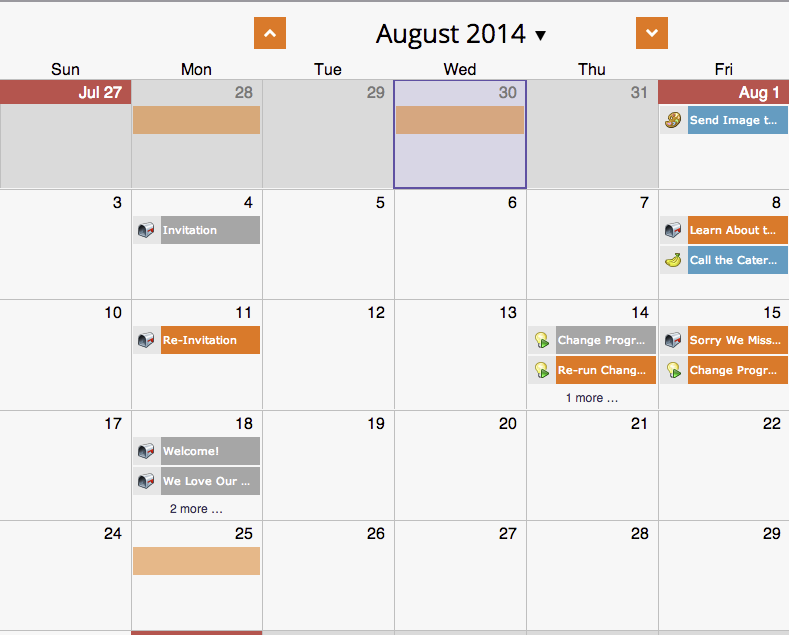

# Erstellen benutzerdefinierter Überlagerungen in der Ansicht „Programmplanung“ {#creating-custom-overlays-in-program-schedule-view}

Sie können benutzerdefinierte Überlagerungen erstellen, um die für Ihre Anforderungen relevanten Einträge anzuzeigen.

1. Klicken Sie auf **[!UICONTROL Dropdown-]** Agenda“.

   

1. Wählen Sie **[!UICONTROL Überlagerungen]** aus.

   

1. Wählen Sie [!UICONTROL Eintragstypen] aus, die in der Überlagerung angezeigt werden sollen.

   

1. Sie können auch nach ([-Tags) ](/help/marketo/product-docs/core-marketo-concepts/programs/working-with-programs/use-tags-in-a-program.md){target="_blank"}.

   

   Jetzt zeigt Ihre Überlagerung nur noch die Einträge an, die Sie definiert haben.

   
