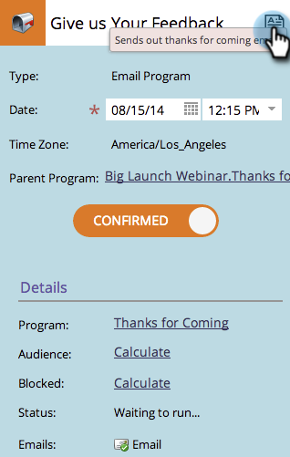

# Bearbeiten von Einträgen in der Ansicht „Programmplanung“ {#editing-entries-in-the-program-schedule-view}

Sie können die verschiedenen Elemente Ihres Programms in der Zeitplanansicht bearbeiten.

## Namen eines Eintrags bearbeiten {#edit-an-entrys-name}

1. Wählen Sie den Eintrag aus, den Sie bearbeiten möchten.

   

1. Geben Sie einen neuen Namen ein und drücken Sie **[!UICONTROL Eingabetaste/]**) auf der Tastatur, um die Änderung zu bestätigen.

   

>[!CAUTION]
>
>Dadurch wird nur der Anzeigename in der Zeitplanansicht geändert. Der Name des Assets in Ihrem Programm bleibt gleich.

## Beschreibung eines Eintrags bearbeiten {#edit-an-entrys-description}

1. Klicken Sie auf das Symbol Beschreibung .

   

1. Bearbeiten Sie Ihre Beschreibung. Klicken Sie auf **[!UICONTROL Speichern]**.

   

1. Die Beschreibung wurde aktualisiert.

   

## Datum eines Eintrags bearbeiten {#edit-an-entrys-date}

1. Wählen Sie das neue Datum aus.

   

Das Datum Ihres Eintrags wurde aktualisiert.

>[!NOTE]
>
> Einträge im Smart Campaign- und E-Mail-Programm, die bereits ausgeführt wurden, können nicht in die Vergangenheit verschoben werden.
