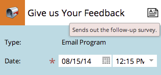

# Bearbeiten von Einträgen in der Programmplanansicht {#editing-entries-in-the-program-schedule-view}

Sie können die verschiedenen Elemente Ihres Programms in der Planungsansicht bearbeiten.

## Name eines Eintrags bearbeiten {#edit-an-entrys-name}

1. Wählen Sie den Eintrag aus, den Sie bearbeiten möchten.

   

1. Geben Sie einen neuen Namen ein und drücken Sie die Eingabetaste. **[!UICONTROL Eingabe/Rückgabe]** auf der Tastatur, um die Änderung zu bestätigen.

   

>[!CAUTION]
>
>Dadurch wird nur der Anzeigename in der Planungsansicht geändert. Der Name des Assets in Ihrem Programm bleibt derselbe.

## Beschreibung eines Eintrags bearbeiten {#edit-an-entrys-description}

1. Klicken Sie auf das Beschreibungssymbol.

   

1. Bearbeiten Sie Ihre Beschreibung. Klicken Sie auf **[!UICONTROL Speichern]**.

   

1. Sehr gut! Ihre Beschreibung wurde geändert.

   

## Datum eines Eintrags bearbeiten {#edit-an-entrys-date}

1. Wählen Sie das neue Datum aus.

   

Du rock! Jetzt wurde das Datum Ihres Eintrags in ein neues Datum verschoben.

>[!NOTE]
>
> Smart-Campaign- und E-Mail-Programmeinträge, die bereits ausgeführt wurden, können nicht in die Vergangenheit verschoben werden.
