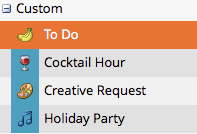

# Ausblenden und Aufheben der Ausblendung benutzerdefinierter Einstiegstypen {#hiding-and-unhiding-custom-entry-types}

Benutzerdefinierte Eintragstypen können im Admin-Abschnitt ausgeblendet werden. Nach dem Ausblenden wird der Eintragstyp nicht mehr als Option angezeigt.

## Ausblenden eines benutzerdefinierten Einstiegstyps {#hide-a-custom-entry-type}

1. Wechseln Sie zum Abschnitt **[!UICONTROL Admin]** und klicken Sie auf **[!UICONTROL Kalendereintrittstypen]**.

   

1. Klicken Sie mit der rechten Maustaste auf Ihren benutzerdefinierten Eintrag und klicken Sie auf **[!UICONTROL Ausblenden]**.

   

   Fantastisch. Dieser Eintragstyp ist nicht mehr verfügbar.

## Einblenden eines benutzerdefinierten Einstiegstyps {#unhide-a-custom-entry-type}

Wenn Sie einen benutzerdefinierten Eingabetyp wieder einblenden möchten, ist dies ebenfalls einfach.

1. Klicken Sie mit der rechten Maustaste auf Ihren Eintrag und wählen Sie **[!UICONTROL Einblenden]** aus.

   

   Ta-da! Ihr benutzerdefinierter Eingabetyp ist jetzt nicht mehr ausgeblendet.

   
