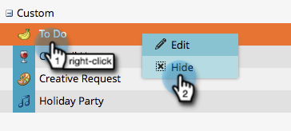

# Ein- und Ausblenden benutzerdefinierter Eintragstypen {#hiding-and-unhiding-custom-entry-types}

Benutzerdefinierte Eintragstypen können im Administratorbereich ausgeblendet werden. Nach dem Ausblenden wird der Eintragstyp nicht mehr als Option angezeigt.

## Ausblenden eines benutzerdefinierten Eintragstyps {#hide-a-custom-entry-type}

1. Gehen Sie zum Abschnitt **[!UICONTROL Admin]** und klicken Sie auf **[!UICONTROL Kalendereintragstypen]**.

   

1. Klicken Sie mit der rechten Maustaste auf den benutzerdefinierten Eintrag und klicken Sie auf **[!UICONTROL Ausblenden]**.

   

   Dieser Eintragstyp ist nicht mehr verfügbar.

## Benutzerdefinierten Eintragstyp einblenden {#unhide-a-custom-entry-type}

So blenden Sie einen benutzerdefinierten Eintragstyp ein:

1. Klicken Sie mit der rechten Maustaste auf den Eintrag und wählen Sie **[!UICONTROL Einblenden]**.

   

   Der benutzerdefinierte Eintragstyp ist jetzt sichtbar.

   
