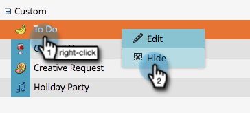

# Ausblenden und Ausblenden benutzerdefinierter Eingabetypen {#hiding-and-unhiding-custom-entry-types}

Benutzerdefinierte Eintragstypen können im Abschnitt &quot;Admin&quot;ausgeblendet werden. Nach dem Ausblenden wird der Eintragstyp nicht mehr als Option angezeigt.

## Benutzerdefinierter Einstiegstyp {#hide-a-custom-entry-type} ausblenden

1. Wechseln Sie zum Abschnitt **Admin** und klicken Sie auf **Kalendereintrag** **Typen**.

   

1. Klicken Sie mit der rechten Maustaste auf Ihren benutzerdefinierten Eintrag und klicken Sie auf **Ausblenden**.

   

   Fantastisch. Dieser Eintragstyp ist nicht mehr verfügbar.

## Ein-/Ausblenden eines benutzerdefinierten Eintragstyps {#unhide-a-custom-entry-type}

Wenn Sie einen benutzerdefinierten Einstiegstyp wieder einblenden möchten, ist das ebenfalls ganz einfach.

1. Klicken Sie mit der rechten Maustaste auf den Eintrag und wählen Sie **Rückgängig**.

   

   Ta-da! Ihr benutzerdefinierter Eintragstyp wird jetzt nicht mehr ausgeblendet.

   
