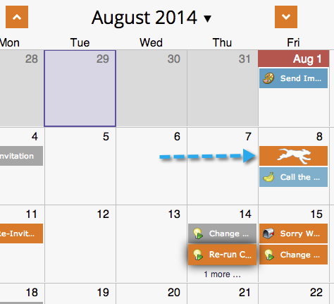

# Verschieben von Einträgen in die Programmplanansicht {#moving-entries-in-the-program-schedule-view}

Durch Verschieben von Einträgen in die Zeitplanansicht werden sie automatisch neu geplant.

>[!NOTE]
>
>Ein bereits ausgeführtes Smart-Kampagne-, Interaktions- oder E-Mail-Hochladeprogramm kann nicht verschoben werden.

1. Wählen Sie Ihren Eintrag aus. Ziehen Sie es per Drag-and-Drop an ein anderes Datum.

   

1. Unser Datenabruf verweigert dann die Genehmigung, ändert das Datum und genehmigt das Asset erneut. Er ist so cool.

   

   Ihr Eintrag wird jetzt neu geplant.

   
