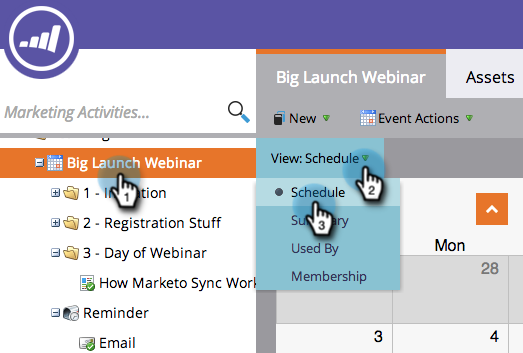
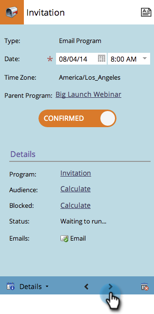
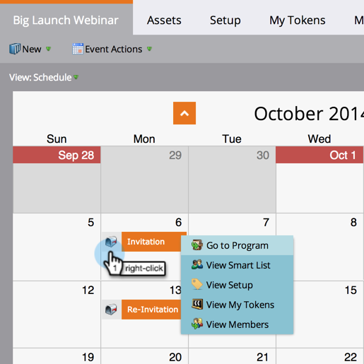
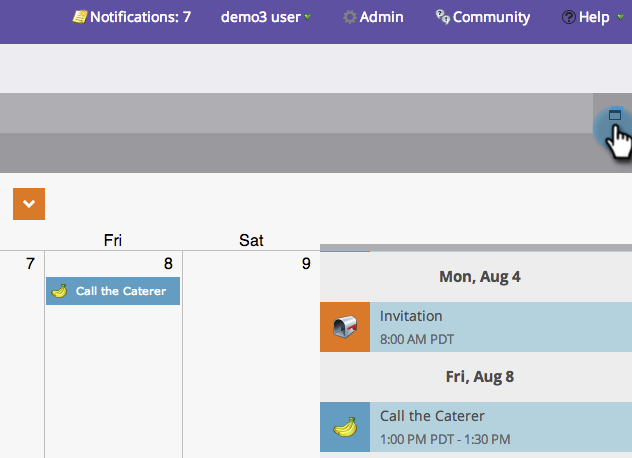

# Navigieren in der Programmplanansicht {#navigating-the-program-schedule-view}

Im Folgenden finden Sie die Grundlagen für die Navigation in der Programmplanansicht.

## Suchen Sie die Planansicht . {#find-the-schedule-view}

1. Navigieren Sie zu **[!UICONTROL Marketingaktivitäten]**.

   

1. Wählen Sie Ihr Programm aus. Klicken Sie auf **[!UICONTROL Ansicht]** angezeigt. Auswählen **[!UICONTROL Zeitplan]**.

   

   Jetzt sehen Sie sich die Planung Ihres Programms an.

   

>[!NOTE]
>
>Die Programmplanungsansicht hängt. Sobald Sie sie festgelegt haben, werden alle Programme standardmäßig in der Planungsansicht angezeigt.

## Wechseln zwischen Einträgen {#switching-between-entries}

1. Klicken Sie in den Einstiegsdetails auf die Pfeile, um zum nächsten geplanten Eintrag zu wechseln.

   

   Sehr cool, was?

   

## Kontextmenü anzeigen {#view-context-menu}

1. Klicken Sie mit der rechten Maustaste auf ein beliebiges Programm, um Änderungen am Programm, der intelligenten Liste, der Einrichtung, den My Tokens oder den Mitgliedern vorzunehmen.

   

## Ändern zwischen Modi {#changing-between-modes}

1. Klicken auf **[!UICONTROL 3 Wochen]** oder **[!UICONTROL Monat]** ändert die sichtbaren Daten in Ihrer Anzeige.

   

## Vollbildansicht {#full-screen-view}

1. Sie können auf das Bildschirmsymbol oben rechts klicken, um den Programmkalender im Vollbildmodus anzuzeigen.

   

Sehr gut! Nachdem Sie nun wissen, wie Sie Ihr Programm sehen können, lernen wir die anderen coolen Dinge, die es tun kann.

>[!MORELIKETHIS]
>
>[Erstellen eines Eintrags in der Programmplanansicht](/help/marketo/product-docs/core-marketo-concepts/programs/program-schedule-view/creating-an-entry-in-the-program-schedule-view.md){target="_blank"}
