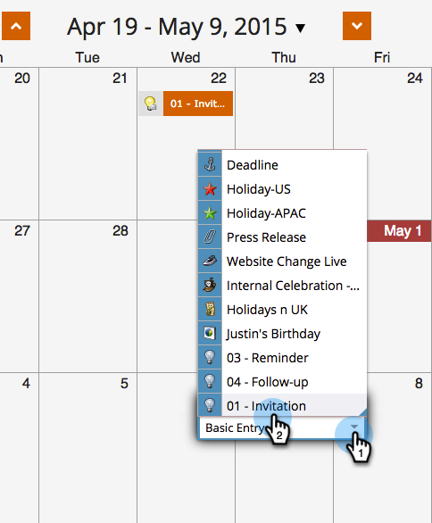

# Erneutes Ausführen einer intelligenten Kampagne in der Ansicht „Programmplanung“ {#rerun-a-smart-campaign-in-the-program-schedule-view}

Neue Ausführungen einer vorhandenen Smart-Kampagne können direkt über die Ansicht Programmplan erstellt werden.

1. Navigieren Sie zu **[!UICONTROL Marketing-Aktivitäten]**.

   

1. Wählen Sie ein Programm aus, das Ihre Smart-Kampagne enthält.

   

1. Klicken Sie in der Zeitplanansicht auf den Tag, für den Sie die neue Ausführung festlegen möchten, und geben Sie Ihrem Eintrag einen leicht verständlichen Namen (z. B. „Zweite Einladung„).

   

1. Wählen Sie im Dropdown-Menü des Eintragstyps die Smart-Kampagne aus, die erneut ausgeführt werden soll.

   

   >[!TIP]
   >
   >Sie können dies auch über den [Programmfokus](/help/marketo/product-docs/core-marketo-concepts/marketing-calendar/understanding-the-calendar/understand-enable-program-focus.md) tun.

Die intelligente Kampagne ist jetzt für eine weitere Ausführung geplant. Wenn es Schritte zum Senden von E-Mails enthält, werden diese ebenfalls hier angezeigt.
