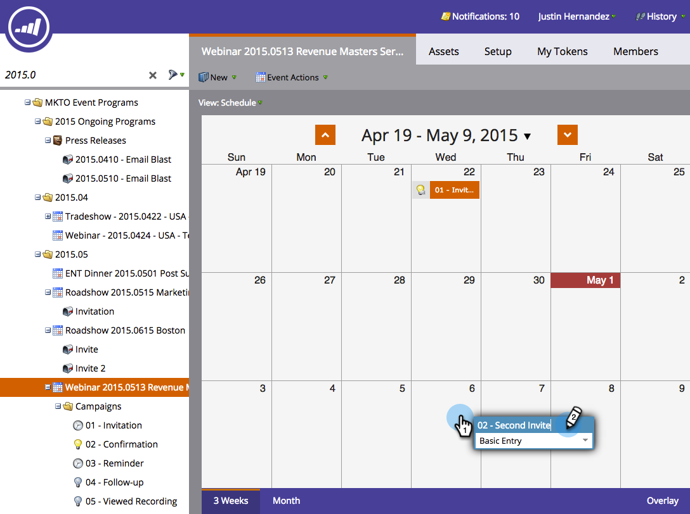

# Eine intelligente Kampagne in der Ansicht Programmplanung {#rerun-a-smart-campaign-in-the-program-schedule-view} erneut ausführen

Sie können ganz einfach neue Runs einer vorhandenen intelligenten Kampagne direkt aus der Programmplanung-Ansicht erstellen.

1. Gehen Sie zu **Marketing-Aktivitäten**.

   

1. Wählen Sie ein Programm aus, das Ihre intelligente Kampagne enthält.

   

1. Klicken Sie in der Ansicht Plan auf den Tag, für den Sie Ihre neue Ausführung einstellen möchten, und geben Sie Ihrem Eintrag einen leicht verständlichen Namen (z.B. &quot;Second Invite&quot;).

   

1. Wählen Sie die Dropdownliste des Eintragstyps aus und wählen Sie die intelligente Kampagne, die Sie erneut ausführen möchten.

   

   >[!TIP]
   >
   >Sie können dies auch über den [Programm focus](/help/marketo/product-docs/core-marketo-concepts/marketing-calendar/understanding-the-calendar/understand-enable-program-focus.md) tun.

Boom! Genau so haben Sie eine weitere Ausführung für diese intelligente Kampagne geplant. Wenn diese intelligente Kampagne E-Mail-Schritte enthält, werden Sie auch diese sehen!
