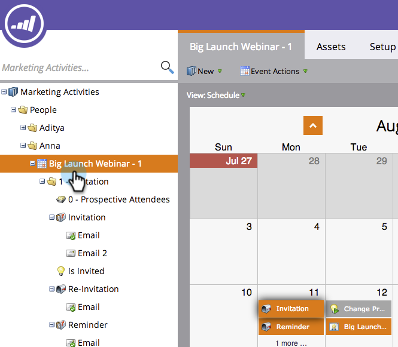
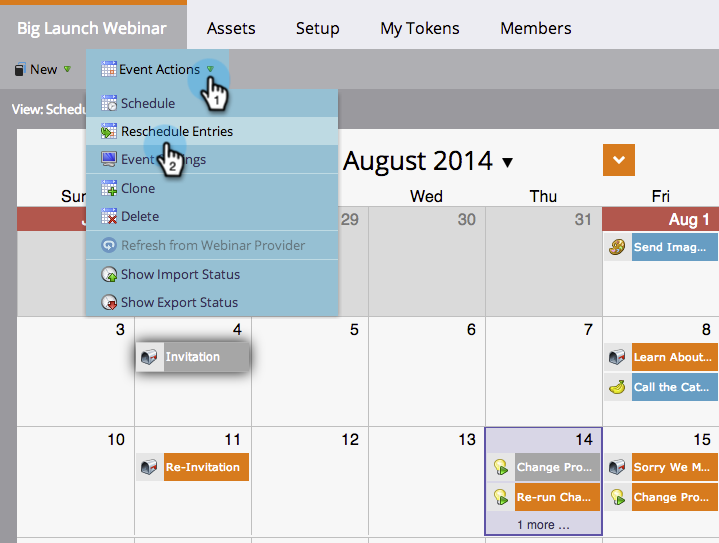

# Ein ganzes Programm über die Zeitplanansicht neu planen {#rescheduling-an-entire-program-from-the-schedule-view}

Wenn Sie ein Programm oder Ereignis mit Datumsangaben klonen, sollten Sie alle Datumsangaben gleichzeitig neu planen. So geht&#39;s.

1. Wählen Sie das Programm aus, das Sie neu planen möchten.

   

1. Wählen Sie die Dropdown-Liste Ereignisaktion aus. Wählen Sie **[!UICONTROL Einträge neu planen]**.

   

1. Einen Ankereintrag auswählen. Basierend auf dieser Verschiebung werden alle anderen Einträge mit ihr verschoben.

   

1. Wählen Sie das neue Startdatum aus.

   

1. Klicken Sie **[!UICONTROL Neu planen]**.

   

1. Unsere Datenabrufer werden dann alle Ihre Assets mit den richtigen Daten genehmigen, neu planen und erneut genehmigen!

   

>[!NOTE]
>
>Assets, die bereits ausgeführt wurden, werden nicht verschoben.

Alles ist jetzt neu geplant. Passen Sie bestimmte Daten nach Bedarf an.

