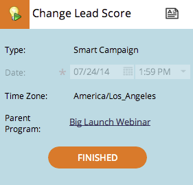

# Grundlagen zu den Tentativen/bestätigten Datumsangaben {#understanding-tentative-confirmed-dates}

Intelligente Kampagnen und E-Mail-Programm verfügen über eine leistungsstarke Funktion, die als **Tentative** oder **Confirmed** gekennzeichnet werden kann. So funktionieren sie.

## Tentativ {#tentative}

Vorsätzliche Datumsangaben vermitteln Absicht. Stellen Sie sich dies als _Pinkeln_ etwas im Kalender vor. Tentative Einträge werden nicht ausgeführt, sondern nur Platzhalter.

>[!NOTE]
>
>Nur intelligente Batch-Kampagnen und E-Mail-Programm können zaghaft sein.

## Bestätigungseinträge {#confirming-entries}

Dies ist genau so wie die Genehmigung eines Assets, daher müssen die Einträge vollständig eingerichtet sein, bevor Sie sie bestätigen können. Sobald sich alle Enten in einer Reihe befinden, können Sie die Einträge bestätigen, indem Sie die zitative Registerkarte nach rechts verschieben.

>[!NOTE]
>
>Warum der Hund? Er ist ein Retriever. Er holt Ihre Daten.

## Bestätigt {#confirmed}

Bestätigte Einträge werden definitiv ausgeführt. Sie verfügen über Regeln, genehmigte Assets und ein bestätigtes Datum und eine bestätigte Uhrzeit.

## Beendet  {#finished}

Fertige Einträge wurden bereits ausgeführt. Sie können nur in der Vergangenheit sein (offensichtlich). Nachdem ein Eintrag ausgeführt wurde und **Fertig** ist, können Sie ihn nicht verschieben oder vorläufig einstellen. (Keine Änderung der Realität und Unterbrechung des Zeitstrom-Kontinuums.)

Diese Zustände sind leistungsstarke Werkzeuge. Wenn Sie ein Programm klonen, sind alle Daten für die intelligente Kampagne und das E-Mail-Programm vorläufig. Sie können alle ab der Ansicht des Zeitplans bestätigt werden. Cool, nicht wahr?
