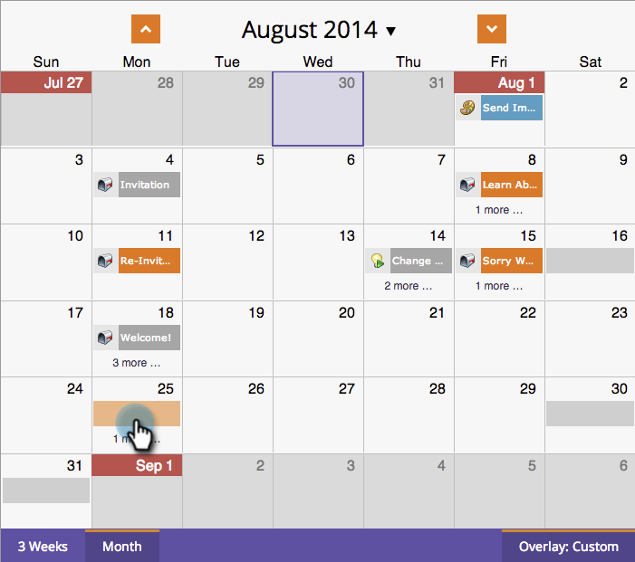

# Verwenden eines globalen Overlays {#using-a-global-overlay}

Durch die globale Überlagerung in der Programmplanungsansicht können Sie Ihr Programm in Bezug auf andere geplante Assets anzeigen.

>[!PREREQUISITES]
>
>Sie müssen über eine [Marketing-Kalender-Lizenz](/help/marketo/product-docs/core-marketo-concepts/marketing-calendar/understanding-the-calendar/issue-revoke-a-marketing-calendar-license.md){target="_blank"} verfügen, um diese Funktion nutzen zu können.

## Globale Überlagerung verwenden {#use-the-global-overlay}

1. Wählen Sie Ihr Programm.

   

1. Wählen **[!UICONTROL Überlagern]** in der rechten unteren Ecke aus.

   

1. Die Volumenblöcke stellen Einträge zu diesem Datum dar. Klicken, um Details anzuzeigen.

   

   Die Eingabedetails für Überlagerungselemente sind schreibgeschützt. Klicken Sie auf das übergeordnete Programm, um Änderungen vorzunehmen.

   

## Verwenden eines gespeicherten Filters als Überlagerung {#use-a-saved-filter-as-an-overlay}

Wenn Sie [Filter im Marketing-Kalender gespeichert haben](/help/marketo/product-docs/core-marketo-concepts/marketing-calendar/working-with-the-calendar/saving-a-filter-definition-in-the-marketing-calendar.md){target="_blank"} können Sie ihn als Überlagerung in der Programmplanansicht verwenden.

1. Klicken Sie auf **[!UICONTROL Dropdown]**&#x200B;Überlagerung und wählen Sie Ihre Filterdefinition aus.

   

   Jetzt sehen Sie eine Überlagerung, die durch den Filter definiert wird, den Sie gespeichert und ausgewählt haben.

   

   >[!MORELIKETHIS]
   >
   >[Erstellen benutzerdefinierter Überlagerungen in der Ansicht „Programmplan“](/help/marketo/product-docs/core-marketo-concepts/programs/program-schedule-view/creating-custom-overlays-in-program-schedule-view.md){target="_blank"}
