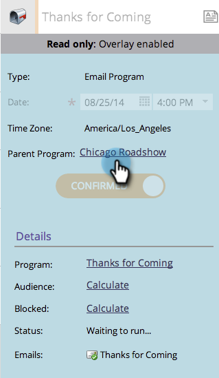

# Verwenden einer globalen Überlagerung {#using-a-global-overlay}

Mit der globalen Überlagerung in der Ansicht &quot;Programmplanung&quot;können Sie Ihr Programm in Bezug auf andere geplante Assets anzeigen.

>[!PREREQUISITES]
>
>Sie müssen über eine [Marketing-Kalender-Lizenz](/help/marketo/product-docs/core-marketo-concepts/marketing-calendar/understanding-the-calendar/issue-revoke-a-marketing-calendar-license.md) verfügen, um diese Funktion nutzen zu können.

## Globale Überlagerung verwenden {#use-the-global-overlay}

1. Wählen Sie Ihr Programm aus.

   

1. Wählen Sie **Überlagerung** in der unteren rechten Ecke aus.

   

1. Die festen Blöcke stellen Einträge zu diesem Datum dar. Klicken Sie auf , um Details anzuzeigen.

   

   Die Eintragsdetails für Überlagerungselemente sind schreibgeschützt. Klicken Sie auf das übergeordnete Programm, um Änderungen vorzunehmen.

   

## Verwenden eines gespeicherten Filters als Überlagerung {#use-a-saved-filter-as-an-overlay}

Wenn Sie im Marketingkalender](/help/marketo/product-docs/core-marketo-concepts/marketing-calendar/working-with-the-calendar/saving-a-filter-definition-in-the-marketing-calendar.md) einen Filter gespeichert haben, können Sie ihn als Überlagerung in der Ansicht &quot;Programmplanung&quot;verwenden.[

1. Klicken Sie auf die Dropdownliste **Überlagerung** und wählen Sie Ihre Filterdefinition aus.

   

   So einfach! Jetzt sehen Sie eine Überlagerung, die durch den gespeicherten und ausgewählten Filter definiert wird.

   

   >[!MORELIKETHIS]
   >
   >[Erstellen benutzerdefinierter Überlagerungen in der Ansicht &quot;Programmplanung&quot;](/help/marketo/product-docs/core-marketo-concepts/programs/program-schedule-view/creating-custom-overlays-in-program-schedule-view.md)
