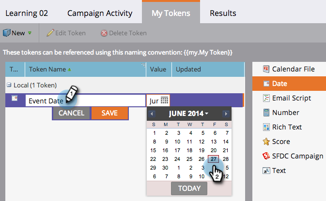
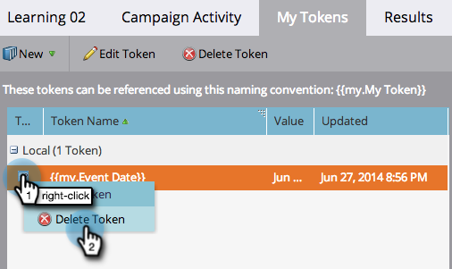

# Meine Token verwalten {#managing-my-tokens}

Die Verwendung von Token kann Ihre Arbeit in Marketo vereinfachen. Sie können [Meine Token](/help/marketo/product-docs/core-marketo-concepts/programs/tokens/understanding-my-tokens-in-a-program.md){target="_blank"} (benutzerdefinierte Token) in Flussschritten, Webhooks, E-Mails und Landingpages verwenden. So stellt man sie her.

>[!TIP]
>
>Weitere Informationen dazu, welche Token bereits verfügbar sind, finden Sie unter [ von Token ](/help/marketo/product-docs/demand-generation/landing-pages/personalizing-landing-pages/tokens-overview.md){target="_blank"}.

## Mein Token erstellen {#create-a-my-token}

1. Navigieren Sie **[!UICONTROL Marketing-Aktivitäten]**.

   

1. Programm- oder Kampagnenordner auswählen. Klicken Sie **[!UICONTROL Meine Token]**.

   

1. Wählen Sie einen **[!UICONTROL Mein Token]**-Typ aus. Ziehen Sie es auf die Arbeitsfläche.

   

1. Geben Sie einen eindeutigen Namen ein. Geben Sie einen relevanten Wert für das Token ein.

   

1. Klicken Sie auf **[!UICONTROL Speichern]**.

   

   Juhu! Du hast ein My Token gemacht.

   

## Mein Token bearbeiten {#edit-a-my-token}

1. Doppelklicken Sie auf &quot;**[!UICONTROL Token]** und nehmen Sie Ihre Änderungen vor. Klicken Sie auf **Speichern**.

   

## Mein Token löschen {#delete-a-my-token}

>[!CAUTION]
>
>Wenn Sie ein Mein Token löschen, stellen Sie sicher, dass Sie in keinem Asset darauf verweisen. Ein Leerzeichen wird an jeder Stelle angezeigt, an der es referenziert wird, wenn es gelöscht wird.

1. Klicken Sie mit der rechten Maustaste auf **[!UICONTROL Mein Token]**. Wählen Sie **[!UICONTROL Token löschen]** aus.

   

1. Klicken Sie auf **[!UICONTROL Löschen]**.

   

   >[!MORELIKETHIS]
   >
   >* [Token-Übersicht](/help/marketo/product-docs/demand-generation/landing-pages/personalizing-landing-pages/tokens-overview.md){target="_blank"}
   >* [Verstehen meiner Token in einem Programm](/help/marketo/product-docs/core-marketo-concepts/programs/tokens/understanding-my-tokens-in-a-program.md){target="_blank"}
   >* [Verwenden von URLs in meinen Token](/help/marketo/product-docs/email-marketing/general/using-tokens/using-urls-in-my-tokens.md){target="_blank"}
