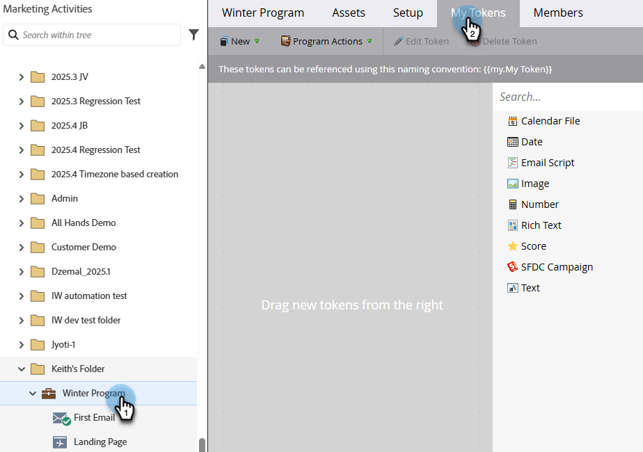

# Meine Token verwalten {#managing-my-tokens}

Die Verwendung von Token kann Ihre Arbeit in Marketo Engage vereinfachen. Sie können [Meine Token](/help/marketo/product-docs/core-marketo-concepts/programs/tokens/understanding-my-tokens-in-a-program.md){target="_blank"} (benutzerdefinierte Token) in Flussschritten, Webhooks, E-Mails und Landingpages verwenden. So stellt man sie her.

>[!TIP]
>
>Weitere Informationen dazu, welche Token bereits verfügbar sind, finden Sie unter [ von Token ](/help/marketo/product-docs/demand-generation/landing-pages/personalizing-landing-pages/tokens-overview.md){target="_blank"}.

## Erstellen eines lokalen oder globalen My Token {#create-a-my-token}

>[!BEGINTABS]

>[!TAB Lokale meine Token]

1. Wählen **[!UICONTROL unter]** das gewünschte Programm oder den gewünschten Kampagnenordner aus und klicken Sie auf die Registerkarte **[!UICONTROL Meine Token]**.

   

1. Ziehen Sie das gewünschte Mein Token auf die Arbeitsfläche.

   

1. Geben Sie einen eindeutigen Namen ein und geben Sie einen relevanten Wert ein.

   

1. Klicken Sie auf **[!UICONTROL Speichern]**.

   

>[!TAB Meine globalen Token]

>[!NOTE]
>
>Administratorrechte erforderlich.

1. Wechseln Sie zum Bereich **[!UICONTROL Admin]** und wählen Sie **[!UICONTROL Meine Token]** aus.

   

1. Ziehen Sie das gewünschte Mein Token auf die Arbeitsfläche.

   

1. Geben Sie einen eindeutigen Namen ein und geben Sie einen relevanten Wert ein.

   

1. Klicken Sie auf **[!UICONTROL Speichern]**.

   

>[!ENDTABS]

## Mein Token bearbeiten {#edit-a-my-token}

1. Wählen Sie das Token aus, das Sie bearbeiten möchten, und klicken Sie auf **[!UICONTROL Token bearbeiten]**.

   

1. Nehmen Sie die gewünschten Änderungen vor. Klicken Sie auf **[!UICONTROL Speichern]**, wenn Sie fertig sind.

   

## Mein Token löschen {#delete-a-my-token}

>[!CAUTION]
>
>Wenn Sie ein Mein Token löschen, stellen Sie sicher, dass es derzeit in keinem Asset referenziert wird. Ein Leerzeichen wird an jeder Stelle angezeigt, an der es referenziert wird, wenn es gelöscht wird.

1. Wählen Sie das Token aus, das Sie löschen möchten, und klicken Sie auf **[!UICONTROL Token löschen]**.

   

1. Klicken Sie auf **[!UICONTROL Löschen]**.

   

   >[!MORELIKETHIS]
   >
   >* [Token-Übersicht](/help/marketo/product-docs/demand-generation/landing-pages/personalizing-landing-pages/tokens-overview.md){target="_blank"}
   >* [Verstehen meiner Token in einem Programm](/help/marketo/product-docs/core-marketo-concepts/programs/tokens/understanding-my-tokens-in-a-program.md){target="_blank"}
   >* [Verwenden von URLs in meinen Token](/help/marketo/product-docs/email-marketing/general/using-tokens/using-urls-in-my-tokens.md){target="_blank"}
