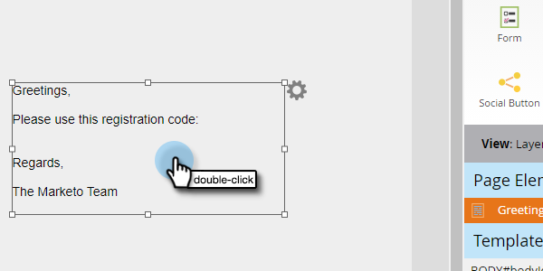
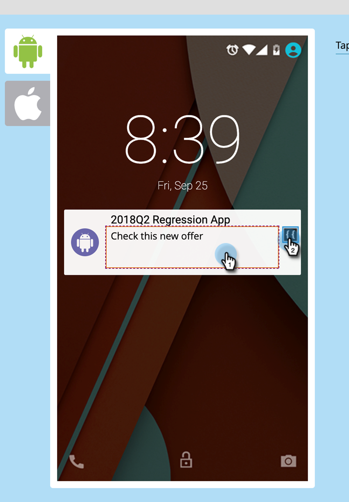

# Benutzerdefinierte Feld-Token für Programmteilnehmer {#program-member-custom-field-tokens}

## Token-Unterstützung für benutzerdefinierte Felder von Programmmitgliedern {#token-support-for-program-member-custom-fields}

Auf der Rückseite der Funktionen für benutzerdefinierte Felder von Programmmitgliedern wird die Unterstützung für benutzerdefinierte Felder von Programmmitgliedern in Token-Frameworks erweitert.

Die PMCF-Token werden unter der Mitglieddomäne der Token-Familie unterstützt.

Mitglieder-Token werden für Felder verwendet, die in den Bereich „Programmteilnehmer“ fallen. Ab dem aktuellen Status werden Mitglieder-Token auch verwendet, um eindeutige Werte von integrierten Service-Partnern einzufügen. `{{member.webinar url}}` Token löst automatisch die eindeutige Bestätigungs-URL der Person auf, die vom Dienstleister generiert wurde. {{member.registration code}} wird zum Registrierungs-Code aufgelöst, der vom Dienstleister bereitgestellt wird.

>[!NOTE]
>
>* Benutzerdefinierte Felder für Programmteilnehmer können nur im Kontext eines Programms verwendet werden.
>* Benutzerdefinierte Felder für Programmteilnehmer können nicht in folgenden Bereichen verwendet werden: E-Mail-Preheader, Datums-Token in Warteschritten oder Snippets.
>* Der Status des Programmmitglieds wird in Mitglieds-Token nicht unterstützt.

## Verwenden der benutzerdefinierten Feld-Token für Programmteilnehmer in Assets {#using-program-member-custom-field-tokens-in-assets}

Benutzerdefinierte Felder für Programmteilnehmer können in E-Mails, Landingpages, SMS, Push-Benachrichtigungen und Webhooks eingefügt werden.

**E-Mails**

1. Wählen Sie die gewünschte E-Mail aus und klicken Sie auf **[!UICONTROL Entwurf bearbeiten]**.

   

1. Klicken Sie auf das Symbol Token einfügen .

   

1. Suchen Sie das gewünschte Token im Feld Benutzerdefiniertes Programmmitglied, wählen Sie es aus, geben Sie einen Standardwert ein und klicken Sie auf **[!UICONTROL Einfügen]**.

   

1. Klicken Sie auf **[!UICONTROL Speichern]**.

   

>[!NOTE]
>
>Vergessen Sie nicht, Ihre E-Mail zu genehmigen.

**Landingpages**

1. Wählen Sie Ihre Landingpage aus und klicken Sie auf **[!UICONTROL Entwurf bearbeiten]**.

   

   >[!NOTE]
   >
   >Der Landingpage-Designer wird in einem neuen Fenster geöffnet.

1. Doppelklicken Sie auf das Rich-Text-Feld, dem Sie das Token hinzufügen möchten.

   

1. Klicken Sie an die Stelle, an der das Token sein soll, und klicken Sie dann auf das Symbol Token einfügen .

   

1. Suchen und wählen Sie das gewünschte Token aus.

   

1. Geben Sie einen Standardwert ein und klicken Sie auf **[!UICONTROL Einfügen]**.

   

1. Klicken Sie auf **[!UICONTROL Speichern]**.

   

**SMS**

1. Wählen Sie die gewünschte SMS aus und klicken Sie auf **[!UICONTROL Entwurf bearbeiten]**.

   

1. Klicken Sie auf die Schaltfläche **`{{ Token`** .

   

1. Suchen Sie das gewünschte Token für das benutzerdefinierte Feld Programmteilnehmer und wählen Sie es aus. Geben Sie einen [!UICONTROL Standardwert“ ein ] klicken Sie auf **[!UICONTROL Einfügen]**.

   

1. Klicken Sie auf die Dropdown-Liste SMS-Aktionen und wählen Sie **[!UICONTROL Genehmigen und schließen]**.

   

**Push-Benachrichtigungen**

1. Wählen Sie die gewünschte Push-Benachrichtigung aus und klicken Sie auf **[!UICONTROL Entwurf bearbeiten]**.

   

1. Klicken Sie auf **[!UICONTROL Push-Benachrichtigung]**.

   

1. Klicken Sie im Editor auf die Nachricht und dann auf die Schaltfläche `{{` , um die Token-Auswahl aufzurufen.

   

1. Suchen Sie das gewünschte Token für das benutzerdefinierte Feld Programmteilnehmer und wählen Sie es aus. Geben Sie einen Standardwert ein und klicken Sie auf **[!UICONTROL Einfügen]**.

   

1. Klicken Sie auf **[!UICONTROL Beenden]**, um zu speichern und zu beenden (oder **[!UICONTROL Weiter]**, um zuerst zu überprüfen).

   

>[!NOTE]
>
>Wenn das benutzerdefinierte Feld Programmteilnehmer für ein Programmmitglied keinen Wert hat, wird das Token durch den Standardwert ersetzt, sofern dieser angegeben wurde.

## Verwenden der Token für benutzerdefinierte Felder von Programmmitgliedern in Kampagnen {#using-program-member-custom-field-tokens-in-campaigns}

Benutzerdefinierte Feld-Token für Programmteilnehmer können in folgenden Bereichen verwendet werden:

* Aufgabe erstellen
* Aufgabe in Microsoft erstellen
* Interessante Momente
* Fluss-Aktionen für Datenwerte ändern
* Webhooks
