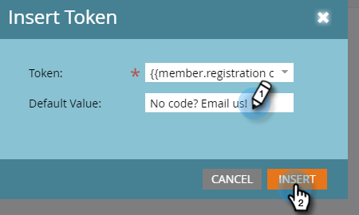

# Benutzerdefinierte Feld-Token für Programmteilnehmer {#program-member-custom-field-tokens}

## Token-Unterstützung für benutzerdefinierte Felder für Programmmitglieder {#token-support-for-program-member-custom-fields}

Auf der Rückseite der Funktionen für benutzerdefinierte Felder des Programmmitglieds wird die Unterstützung für benutzerdefinierte Felder des Programmmitglieds in Token-Frameworks erweitert.

Die PMCF-Token werden unter der Mitgliederdomäne der Token-Familie unterstützt.

Mitglieder-Token werden für Felder verwendet, die unter den Geltungsbereich des Programmmitglieds fallen. Ab dem aktuellen Status werden Member Tokens auch verwendet, um eindeutige Werte von integrierten Servicepartnern einzufügen. `{{member.webinar url}}` -Token löst automatisch die eindeutige Bestätigungs-URL der Person auf, die vom Dienstleister generiert wurde. {{member.registration code}} wird in den vom Dienstleister bereitgestellten Registrierungs-Code aufgelöst.

>[!NOTE]
>
>* Benutzerdefinierte Felder für Programmmitglieder können nur im Kontext eines Programms verwendet werden.
>* Benutzerdefinierte Felder des Programmmitglieds können nicht in verwendet werden: E-Mail-Preheader, Datum-Token in Warteschritten oder Snippets.
>* Der Status der Programmteilnehmer wird in den Mitglieds-Token nicht unterstützt.

## Verwenden von benutzerdefinierten Feld-Token für Programmteilnehmer in Assets {#using-program-member-custom-field-tokens-in-assets}

Sie können Token für benutzerdefinierte Felder des Programmmitglieds in E-Mails, Landingpages, SMS, Push-Benachrichtigungen und Webhooks einfügen.

**E-Mails**

1. Wählen Sie die gewünschte E-Mail aus und klicken Sie auf **[!UICONTROL Entwurf bearbeiten]**.

   

1. Klicken Sie auf das Symbol Token einfügen .

   

1. Suchen und wählen Sie das gewünschte benutzerdefinierte Feld-Token für Programmteilnehmer aus, geben Sie einen Standardwert ein und klicken Sie auf **[!UICONTROL Einfügen]**.

   

1. Klicken Sie auf **[!UICONTROL Speichern]**.

   

>[!NOTE]
>
>Vergessen Sie nicht, Ihre E-Mail zu genehmigen.

**Einstiegsseiten**

1. Wählen Sie Ihre Landingpage aus und klicken Sie auf **[!UICONTROL Entwurf bearbeiten]**.

   

   >[!NOTE]
   >
   >Der Landingpage-Designer wird in einem neuen Fenster geöffnet.

1. Doppelklicken Sie auf das Rich-Text-Feld, dem Sie das Token hinzufügen möchten.

   

1. Klicken Sie auf die Stelle, an der das Token platziert werden soll, und klicken Sie dann auf das Symbol Token einfügen .

   

1. Suchen und wählen Sie das gewünschte Token aus.

   

1. Geben Sie einen Standardwert ein und klicken Sie auf **[!UICONTROL Einfügen]**.

   

1. Klicken Sie auf **[!UICONTROL Speichern]**.

   

**SMS**

1. Wählen Sie die gewünschte SMS aus und klicken Sie auf **[!UICONTROL Entwurf bearbeiten]**.

   

1. Klicken Sie auf die Schaltfläche **`{{ Token`** .

   

1. Suchen und wählen Sie das gewünschte benutzerdefinierte Feld-Token für Programmteilnehmer aus. Geben Sie einen Standardwert ein und klicken Sie auf Einfügen.

   

1. Klicken Sie auf das Dropdown-Menü SMS-Aktionen und wählen Sie **[!UICONTROL Genehmigen und schließen]** aus.

   

**Push-Benachrichtigungen**

1. Wählen Sie die gewünschte Push-Benachrichtigung aus und klicken Sie auf **[!UICONTROL Entwurf bearbeiten]**.

   

1. Klicken Sie auf **[!UICONTROL Push Notification]**.

   

1. Klicken Sie auf die Nachricht im Editor und klicken Sie auf die Schaltfläche `{{` , um die Token-Auswahl abzurufen.

   

1. Suchen und wählen Sie das gewünschte benutzerdefinierte Feld-Token für Programmteilnehmer aus. Geben Sie einen Standardwert ein und klicken Sie auf **[!UICONTROL Einfügen]**.

   

1. Klicken Sie auf **[!UICONTROL Beenden]** , um zu speichern und zu beenden (oder auf **[!UICONTROL Weiter]** , um zuerst zu überprüfen).

   

>[!NOTE]
>
>Wenn das benutzerdefinierte Feld &quot;Programmteilnehmer&quot;für ein Programmmitglied keinen Wert aufweist, wird das Token durch den Standardwert ersetzt, sofern er angegeben wurde.

## Verwenden von benutzerdefinierten Feld-Token für Programmteilnehmer in Kampagnen {#using-program-member-custom-field-tokens-in-campaigns}

Benutzerdefinierte Feld-Token für Programmmitglieder können in folgenden Bereichen verwendet werden:

* Aufgabe erstellen
* Aufgabe in Microsoft erstellen
* Interessante Momente
* Fluss-Aktionen für Datenwerte ändern
* Webhooks
