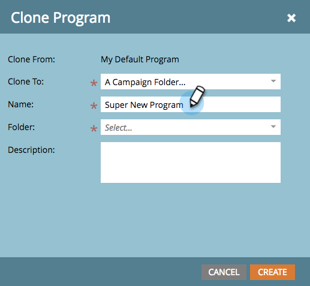

# Klonen eines Programms {#clone-a-program}

Klonen Sie ein ganzes Programm und alle zugehörigen Assets, anstatt alles manuell neu zu erstellen.

1. Suchen Sie das Programm, das Sie klonen möchten, und wählen Sie es aus. Klicken **[!UICONTROL in der Dropdown]** Liste „Programmaktionen“ auf **[!UICONTROL Klonen]**.

   

1. Wählen Sie aus, wohin Sie Ihr Programm klonen möchten.

   >[!NOTE]
   >
   >Programme können in [Kampagnen](/help/marketo/product-docs/core-marketo-concepts/miscellaneous/create-new-campaign-folder.md) [Ordner](/help/marketo/product-docs/core-marketo-concepts/miscellaneous/create-new-campaign-folder.md) oder [Arbeitsbereiche](/help/marketo/product-docs/administration/workspaces-and-person-partitions/create-a-new-workspace.md) geklont werden. Sicherstellen aller zugrunde liegenden abhängigen Assets (E-Mails, Snippets, Landingpage-Vorlagen usw.) werden vor dem Klonen für den Zielarbeitsbereich freigegeben.

   

   >[!NOTE]
   >
   >Sehen Sie diese [!UICONTROL HINWEIS] im obigen Screenshot? Das bedeutet, dass beim Klonen eines Programms mit 1000 oder mehr Personen in einer Liste die Liste selbst geklont wird, aber leer bleibt. Wenn Sie ein Programm mit einer Liste von maximal 999 Personen klonen, wird diese Liste zusammen mit allen Mitgliedern im geklonten Programm angezeigt.

1. Geben Sie einen &quot;**[!UICONTROL &quot;]**.

   

1. Wählen Sie den Zielordner aus.

   

1. Fügen Sie eine optionale Beschreibung hinzu und klicken Sie dann auf **[!UICONTROL Erstellen]**.

   

   >[!TIP]
   >
   >Verwenden Sie diese Technik zusammen mit Token, um die Erstellung neuer Programme zu beschleunigen.

   >[!CAUTION]
   >
   >Periodenkosten werden nicht übertragen. Stellen Sie daher sicher, dass zum geklonten Programm hinzugefügt wird, falls eine Option im Original festgelegt wurde.
