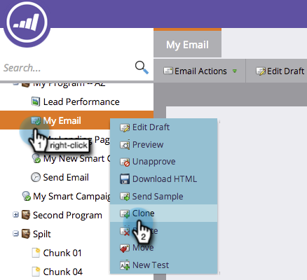
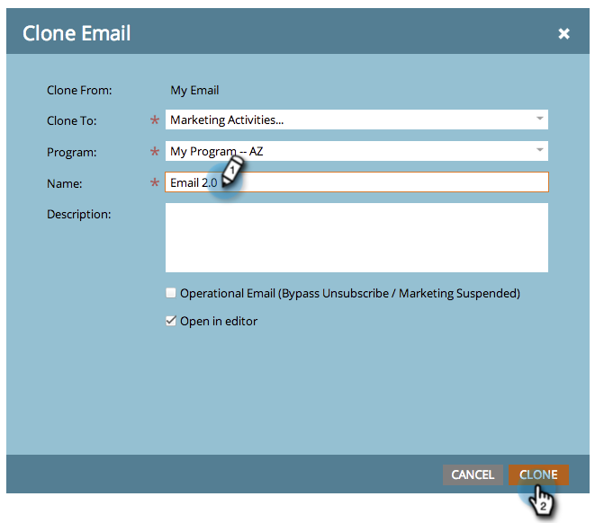

# Klonen eines Assets in einem Programm {#clone-an-asset-in-a-program}

Klonen eines Programms klont _alles_. Manchmal möchten Sie nur ein Asset klonen. Und so geht das.

>[!NOTE]
>
>Sie müssen zusätzliche Schritte ausführen, um [eine Landingpage-Testgruppe zu klonen](/help/marketo/product-docs/demand-generation/landing-pages/landing-page-actions/cloning-a-landing-page-test-group.md){target="_blank"}.

## Klonen eines lokalen Assets {#clone-a-local-asset}

1. Navigieren Sie zu **[!UICONTROL Marketing-Aktivitäten]**.

   

1. Wählen Sie Ihr Programm.

   

1. Klicken Sie mit der rechten Maustaste auf das lokale Asset, das Sie klonen möchten. Klicken Sie **[!UICONTROL Klonen]**.

   

1. Jeder Asset-Typ verfügt über ein anderes Dialogfeld. Füllen Sie einfach die Informationen aus und klicken Sie auf **[!UICONTROL Klonen]**.

   

   >[!TIP]
   >
   >Sie können ein Asset auch in ein anderes Programm klonen. Verwenden Sie die **[!UICONTROL Programm]** Dropdown-Liste, um Ihre Auswahl zu treffen.

1. Sehr gut! Sie sollten jetzt das neue geklonte Asset sehen.

   

   >[!NOTE]
   >
   >[Klonen eines Programms](/help/marketo/product-docs/core-marketo-concepts/programs/working-with-programs/clone-a-program.md){target="_blank"}
