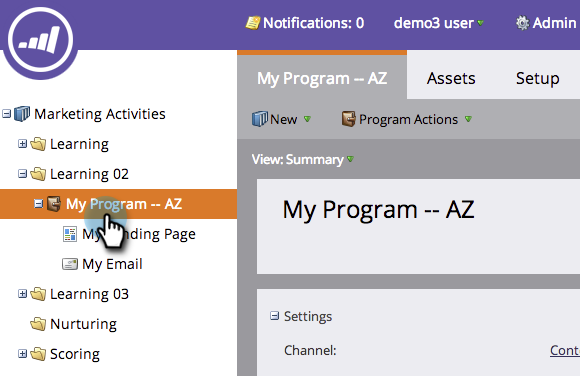

# Löschen eines Programms {#delete-a-program}

Man kann ein Programm archivieren, aber manchmal will man es einfach dauerhaft loswerden. Und so geht das.

1. Wählen Sie das Programm aus, das Sie löschen möchten.

1. Klicken Sie auf **[!UICONTROL Dropdown-Liste]** Programmaktionen“ und wählen Sie **[!UICONTROL Löschen]**.

   

1. Wählen Sie das Optionsfeld „Alle löschen…“ aus. Überprüfen Sie die Auswirkungen des Löschens des Programms und klicken Sie dann zur Bestätigung **[!UICONTROL Löschen]**.

>[!TIP]
>
>Die Archivierung von Programmen bewahrt die Programmdaten auf, stellt das Programm jedoch aus dem Weg. Wählen Sie diese Option aus und klicken Sie **[!UICONTROL Weiter]**, um weitere Details zur Archivierung anzuzeigen.

Fertig. Es ist, als hätte es das Programm nie gegeben.

## Warum kann ich mein Programm nicht löschen? {#why-cant-i-delete-my-program}

Programme können Assets enthalten, die an anderer Stelle im System verwendet werden. Dadurch wird verhindert, dass Sie ein Programm löschen.

Um das Problem zu beheben, müssen Sie möglicherweise eine Aufschlüsselung durchführen und die Genehmigung/Löschung aufheben. Führen Sie die folgenden Schritte aus.

1. Klicken Sie auf den Link, um zum Asset zu wechseln.

   

1. Klicken Sie auf **[!UICONTROL Verwendet von]**, um anzuzeigen, wo das Asset verwendet wird.

   

   Sobald Sie wissen, wo Ihr Asset verwendet wird, gehen Sie zu ihm und genehmigen/löschen Sie es. Versuchen Sie dann erneut, Ihr Programm zu löschen.
