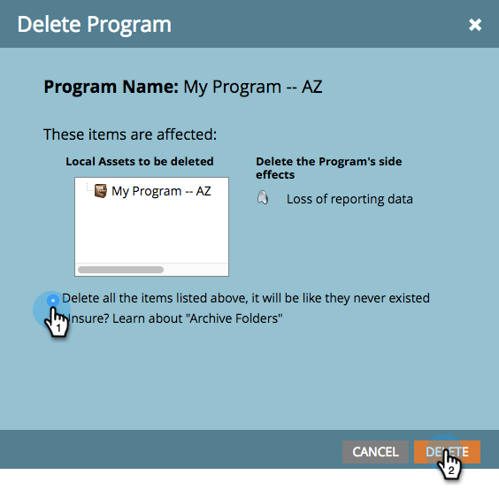

# Löschen eines Programms {#delete-a-program}

Sie können ein Programm archivieren, aber manchmal möchten Sie es einfach dauerhaft loswerden. So geht es.

1. Wählen Sie das Programm aus, das Sie löschen möchten.

1. Klicken Sie auf **Programm Actions**. Klicken Sie auf **Löschen**.

   

1. Wählen Sie die Option &quot;Alle löschen&quot;. Überprüfen Sie die Nebenwirkungen des Löschvorgangs des Programms und klicken Sie zur Bestätigung auf **Löschen**.

>[!TIP]
>
>**Durch die Archivierung** von Programmen bleiben die Daten erhalten, das Programm bleibt Ihnen jedoch aus dem Weg. Wählen Sie diese Option und klicken Sie dann auf **Weiter**, um weitere Details zur Archivierung anzuzeigen.

Fertig. Es ist, als hätte das Programm nie existiert.

## Warum kann ich mein Programm nicht löschen? {#why-cant-i-delete-my-program}

Programm können Assets enthalten, die an anderer Stelle im System verwendet werden. Dadurch wird verhindert, dass Sie ein Programm löschen.

Um das Problem zu beheben, müssen Sie möglicherweise einen Drilldown durchführen und die Genehmigung aufheben/löschen. Führen Sie die folgenden Schritte aus.

1. Klicken Sie auf den Link, um zum Asset zu wechseln.

   

1. Klicken Sie auf **Verwendet von**, um zu sehen, wo das Asset verwendet wird.

   

   Sobald Sie wissen, wo Ihr Asset verwendet wird, gehen Sie zu ihm und heben Sie die Genehmigung/Löschung auf. Versuchen Sie dann erneut, Ihr Programm zu löschen.
