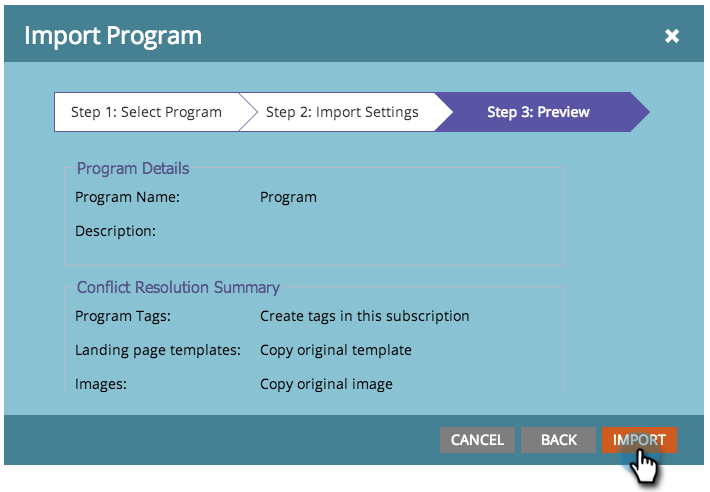

# Programm {#import-a-program} importieren

Ein Programm kann von einem Markt in ein anderes Abonnement importiert werden. Sie können beispielsweise ein Programm in einer Sandbox erstellen und es dann in Ihr Live-Abonnement importieren. Außerdem können Sie ein vordefiniertes Programm aus der Marketing-Programm-Bibliothek importieren.

## Programm {#import-a-program-1} importieren

1. Gehen Sie zu **Marketing-Aktivitäten.**

   

1. Klicken Sie auf **Neu **Dropdown-Liste. Wählen Sie **Programm importieren**.

   

   >[!NOTE]
   >
   >Programm Import ist nur für Benutzer verfügbar, für die die Berechtigung Programm importieren aktiviert ist. Erfahren Sie mehr über [Verwalten von Benutzerrollen und Berechtigungen](../../../../product-docs/administration/users-and-roles/managing-user-roles-and-permissions.md).
   >
   >
   >Um ein Sandbox-Konto mit Ihrem Live-Abonnement zu verbinden, wenden Sie sich an [Marketing Support](http://www.marketo.com/services/support/).

1. Wählen Sie ein Marketo **Abonnement** und ein zu importierendes Programm aus. Klicken Sie auf **Weiter**.

   

1. Geben Sie einen **Kampagne-Ordner** für das importierte Programm an. Klicken Sie auf **Weiter.**

   

   >[!NOTE]
   >
   >Vergewissern Sie sich, dass** ****Standardkonflikt**-Regeln verwenden ausgewählt ist. Konfliktregeln sind erforderlich, wenn Sie Programm in eine Instanz importieren, deren Assets denselben Namen haben.

1. Details zur Vorschau und **Importieren** des Programms.

   

   In einem Dialogfeld wird der Fortschritt beim Importieren des Programms angezeigt.

   

Sobald der Import abgeschlossen ist, erhalten Sie eine E-Mail-Bestätigung.

>[!NOTE]
>
>Sie müssen importierte Batch-Kampagnen neu planen und die Kampagnen aktivieren. Das System deaktiviert automatisch die Zeitpläne der Kampagne und löst Kampagnen im importierten Programm aus.

## Identifizieren Sie vorab erstellte Programm in der Marketing Programm-Bibliothek {#identify-pre-built-programs-in-the-marketo-program-library}

Die Marketing Programm Library enthält vordefinierte, getestete Programm, die Sie in Ihr Abonnement importieren können. Zu den verfügbaren Programmen gehören:

1. **Grundlegende Drip Nurture.** Sendet eine Reihe von E-Mails getrennt durch Warteschritte.
1. **Data Management.** Behält die Datenintegrität mithilfe intelligenter Kampagnen bei.
1. **E-Mail mit Landingpage.** Sendet eine erste E-Mail mit einem Angebot, z. B. &quot;Dieses Whitepaper herunterladen&quot;. Fügt eine Bestätigungs- oder Erinnerungsmail hinzu. Beinhaltet eine Landingpage mit einem Formular.
1. **E-Mail mit Fortschrittsstatus.** Sendet eine Mail-Nachricht mit einem nachverfolgbaren Link, auf den die Person klicken kann. Aktualisiert den Status der Progression für jede Person - Gesendet, Geöffnet, angeklickt usw.
1. **Interessante Momente.** Erstellt interessante Momente für Ihr Verkaufsteam, um sie in der Schleife zu halten.
1. **Landingpage mit Autoresponder.** Verwenden Sie herunterladbare Inhalte, um neue Leute zu gewinnen und sie zu fördern. Umfasst Landingpages und Formulare.
1. **Lebenszyklus 2.** Verwendet Scoring, um eine Person von neu zu marketingfähig zu bewegen.
1. **Mobile E-Mail-Vorlage.** Eine reaktionsfähige E-Mail-Vorlage, die mit iPhone und Android getestet wurde. Bestimmte Versionen von Android-, MS Outlook-, Exchange- und Drittanbieter-Apps wie Gmail und Yahoo! Mobile Mail-Apps unterstützen kein CSS, das für reaktionsfähige Vorlagen erforderlich ist. Wir empfehlen Ihnen, vor dem Versenden von E-Mails einen Test durchzuführen.
1. **Preisausschreiben beim Programm importieren.** Preisausschreiben Programm für diejenigen, die die Programm-Bibliothek ausprobieren! Genehmigen Sie einfach die E-Mails und die Landingpage und aktivieren Sie die intelligente Kampagne. Dann Ansicht die genehmigte Landingpage, füllen Sie das Formular aus und Sie werden eingegeben!
1. **Verfügbare Kampagnen zum Verkauf** Bietet Ihren Vertriebsmitarbeitern eine Möglichkeit, Marketo-intelligente Kampagnen aus einem Dashboard in Ihrem CRM auszuführen.
1. **Scoring - Spark Edition.** Demografische Bewertung und Verhaltens, die in einem einzigen Bewertungsfeld erfasst werden. Umfasst mehr als zwei Dutzend Kampagnen, die mit Scoring zusammenhängen.
1. **Bewertung - Standard- und Select-Editionen.** Demografische Bewertung und Verhaltens, die in separaten Bewertungsfeldern erfasst werden. Umfasst mehr als zwei Dutzend Kampagnen, die mit Scoring zusammenhängen.
1. **Synchronisieren Sie Neue Personen mit CRM.** Die Kampagne, die neue Leute mit Ihrem CRM-System synchronisiert. Er weist einem Personenstand den Status zu, dass er als nicht verkaufsbereit anerkannt wird.
1. **Webinar mit Ereignis Adapter.** Eine ganze Reihe von E-Mails - wie Einladungen und Erinnerungen - sowie Landingpages mit Formularen und Kampagnen, um Menschen durch das Programm zu bewegen. In diesem Programm erhalten Sie aktuelle Informationen zur Registrierung, zur Teilnahme usw. von Online-Ereignissen wie WebEx.
1. **Webinar ohne Ereignis-Adapter.** Wie oben, aber mit manuellen Prozessen zur Registrierung, Anwesenheitskontrolle, etc.
1. **Sirius entscheidet Scoring Programm**. Dieses Programm wurde entwickelt, um das Sirius Decision Scoring-Standardmodell zu unterstützen, einschließlich der impliziten und expliziten Bewertungsregeln und der Zuweisung von Matrixpersonen. Ansicht [diese PDF](http://docs.marketo.com/display/docs/assets/sirius-decisions-scoring-program-overview.pdf)für weitere Informationen.

>[!CAUTION]
>
>Sie müssen zwei benutzerdefinierte Felder (&quot;Demografische Bewertung&quot;und &quot;Verhaltensbewertung&quot;) erstellen, bevor Sie das Programm &quot;Bewertung - Standard- und Auswahl-Editionen&quot;importieren.

## Auswirkungen auf externe Assets bei Programm-Importen {#impact-on-external-assets-during-program-imports}

Programme verwenden externe Assets wie E-Mail-Vorlagen, Vorlagen für Landingpages, Bilder, Formulare, Token und Programm-Tags. Sie haben die Möglichkeit zu konfigurieren, wie Landingpages- und Programm-Tags verarbeitet werden, und Marketo verwaltet den Rest automatisch.

**E-Mail-Vorlagen: **E-Mail-Vorlagen werden automatisch importiert und erstellt, es sei denn, eine mit demselben Namen ist vorhanden.

**Landingpages-Vorlagen: **Landingpages-Vorlagen werden in das Design-Studio importiert. Mithilfe von Konfliktregeln können Sie das Verhalten konfigurieren, wenn eine Vorlage mit demselben Namen vorhanden ist. Bei Verwendung der Standardregel wird eine Landingpage an eine Vorlage angehängt, wenn eine mit demselben Namen vorhanden ist. Eine Vorlage mit dem Namen &quot;Standardvorlage 1&quot;wird beispielsweise erstellt, wenn eine Landingpage mit dem Namen &quot;Standardvorlage&quot;vorhanden ist.

**Bilder: **Von Landingpages verwendete Bilder werden in das Design-Studio importiert, es sei denn, eines mit demselben Namen existiert.

**Token: **Token, die außerhalb eines Programms leben, werden während des Importvorgangs in lokale Token konvertiert.

>[!CAUTION]
>
>Bildtyp, den meine Token für Programm-Importe nicht unterstützen. Wenn ein Programm mit Bildtyp meine Token importiert wird, werden **keine **Token angezeigt.

**Programm-Tags: **Sie können Konfliktregeln verwenden, um zu steuern, wie Programm-Tags, die nicht im Zielkonto vorhanden sind, behandelt werden. Mithilfe der Standardregel werden die Programm-Tags erstellt oder Sie können die Tags ignorieren.  **Forms: **Externe Formulare werden automatisch in das Design-Studio importiert, es sei denn, eines mit demselben Namen ist vorhanden.

>[!CAUTION]
>
>Beim Importieren eines Programms werden Landingpages/E-Mails, die [dynamische Inhalte](http://docs.marketo.com/x/yRAt) enthalten, übersprungen.

## Video ansehen {#watch-a-video}

`<iframe width="630" height="470" src="//play.vidyard.com/KgvZssZ9WRkZgDsY1yZfms.html?v=3.1.1" frameborder="0" allowfullscreen></iframe>`