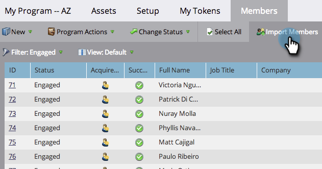

# Importieren von Mitgliedern aus einer Tabelle in ein Programm {#import-members-from-a-spreadsheet-into-a-program}

Sie können eine Liste von Personen importieren, die automatisch Mitglied eines Programms werden. Hier ist, was zu tun ist.

## Vorbereiten Ihrer CSV-Datei {#prepare-your-csv-file}

1. Erstellen Sie eine Standard-CSV-Datei in Excel, wie im Beispiel unten dargestellt.

   

   >[!CAUTION]
   >
   >Verwenden Sie beim Import eines Datums in ein Datumsfeld folgendes Format: 29.9.24 (Monat/Tag/Jahr).

## CSV in Marketo importieren {#import-your-csv-into-marketo}

1. Navigieren Sie in Ihrem Programm zum Abschnitt **[!UICONTROL Member]** .

   

1. Klicken Sie auf **[!UICONTROL Mitglieder importieren]**.

   

1. Wählen Sie die CSV-Datei aus und klicken Sie auf **[!UICONTROL Weiter]**.

   

1. Ordnen Sie die Datenwerte aus der Liste den entsprechenden Marketo-Feldern zu und klicken Sie auf **[!UICONTROL Weiter]**.

   

   >[!NOTE]
   >
   >Wenn es Felder gibt, die Sie nicht importieren möchten, wählen Sie **[!UICONTROL IGNORE]** im Dropdown-Menü &quot;Marketo-Feld&quot;aus.

1. Wählen Sie den **[!UICONTROL Mitgliederstatus]** für Ihre Liste aus.

   

1. Klicken Sie auf **[!UICONTROL Importieren]**.

   

1. Warten Sie, bis Marketo den Import abgeschlossen hat, und schließen Sie dann das Bestätigungsdialogfeld.

   

   Sehr gut! Sie sollten die neuen Mitglieder sehen, die Sie importiert haben.

   

>[!MORELIKETHIS]
>
>[Mitglieder verwalten und anzeigen](/help/marketo/product-docs/core-marketo-concepts/programs/working-with-programs/manage-and-view-members.md){target="_blank"}
