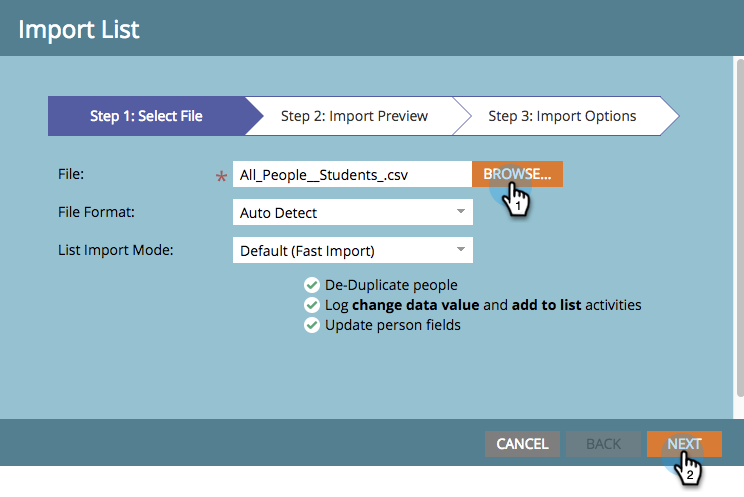

# Mitglieder aus einer Tabelle in ein Programm {#import-members-from-a-spreadsheet-into-a-program} importieren

Sie können eine Liste von Personen importieren, die automatisch Mitglieder eines Programms werden. Hier ist, was zu tun ist.

## Vorbereiten der CSV-Datei {#prepare-your-csv-file}

1. Erstellen Sie eine Standard-CSV-Datei in Excel, wie im folgenden Beispiel.

   

   >[!CAUTION]
   >
   >Verwenden Sie beim Importieren eines Datums in ein Datumsfeld das folgende Format: 29.09.13 (Monat/Tag/Jahr).

## CSV in Marketo importieren {#import-your-csv-into-marketo}

1. Gehen Sie im Programm zum Abschnitt **Member**.

   

1. Klicken Sie auf **Mitglieder importieren**.

   

1. Wählen Sie die CSV aus und klicken Sie auf **Weiter**.

   

1. Ordnen Sie die Datenwerte der Liste den entsprechenden Marketo-Feldern zu und klicken Sie auf **Weiter**.

   

   >[!NOTE]
   >
   >Wenn keine Felder importiert werden sollen, wählen Sie **IGNORE** im Dropdown-Menü &quot;Marketo-Feld&quot;aus.

1. Wählen Sie **Mitgliedsstatus** für Ihre Liste aus.

   

1. Klicken Sie auf **Import**.

   

1. Warten Sie, bis Marketo den Import abgeschlossen hat, und schließen Sie dann das Bestätigungsdialogfeld.

   

   Sehr gut! Sie sollten die neuen Mitglieder sehen, die Sie importiert haben.

   

>[!MORELIKETHIS]
>
>[Mitglieder verwalten und Ansicht](/help/marketo/product-docs/core-marketo-concepts/programs/working-with-programs/manage-and-view-members.md)
