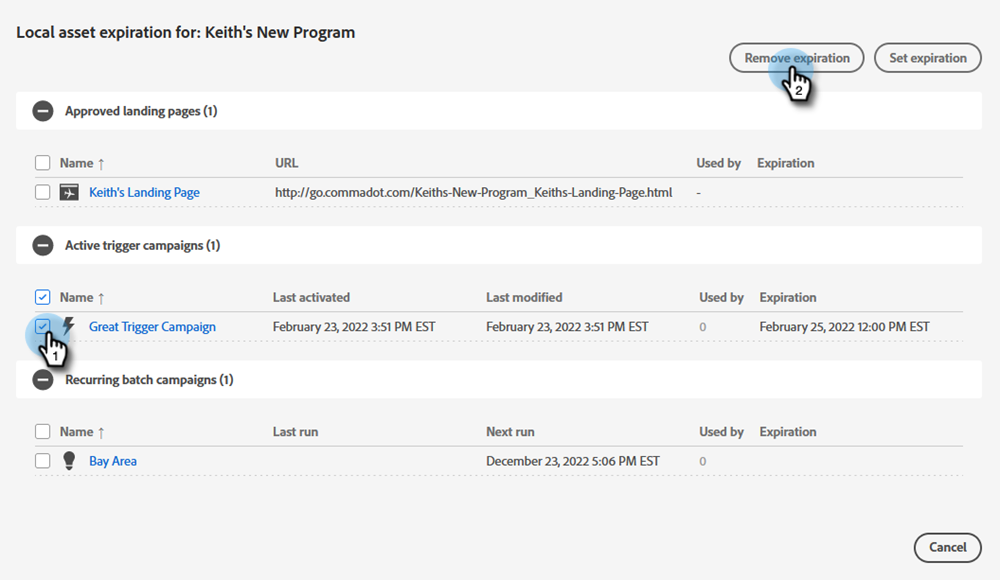

# Lokaler Asset-Ablauf {#local-asset-expiration}

Legen Sie ein Ablaufdatum/eine Ablaufzeit fest, um die Veröffentlichung von Landingpages rückgängig zu machen, Trigger-Kampagnen zu deaktivieren oder wiederkehrende Batch-Kampagnen zu stoppen.

## Berechtigung &quot;Asset-Ablauf planen&quot; {#grant-schedule-asset-expiration-permission}

Bevor Sie einen Asset-Ablauf planen können, muss für Ihre Marketo-Rolle die entsprechende Berechtigung aktiviert sein.

>[!NOTE]
>
>**Erforderliche Administratorberechtigungen**

1. Klicken Sie im Bereich [!UICONTROL Admin] auf **[!UICONTROL Benutzer und Rollen]**.

   

1. Klicken Sie auf die Registerkarte **[!UICONTROL Rollen]**, wählen Sie den Benutzer aus, dem Sie Zugriff gewähren möchten, und klicken Sie dann auf **[!UICONTROL Rolle bearbeiten]**.

   

1. Wählen Sie unter &quot;[!UICONTROL Auf Marketingaktivitäten zugreifen]&quot;die Option &quot;**[!UICONTROL Ablauf lokaler Assets planen]**&quot;und klicken Sie auf &quot;**[!UICONTROL Speichern]**&quot;.

   

## Ablaufdatum festlegen {#set-an-expiration-date}

1. Klicken Sie mit der rechten Maustaste auf das gewünschte Programm und wählen Sie **[!UICONTROL Ablauf des lokalen Assets festlegen]** aus.

   

1. Markieren Sie die Assets, für die Sie ein Ablaufdatum festlegen möchten, und klicken Sie dann auf **[!UICONTROL Gültigkeit festlegen]**.

   

1. Wählen Sie ein Ablaufdatum aus.

   

1. Legen Sie eine Zeit fest. Sie müssen eine Zeit von mindestens 15 Minuten in der Zukunft planen (vergessen Sie nicht, AM/PM zu betreten). Klicken Sie abschließend auf **[!UICONTROL Bestätigen]** .

   

>[!NOTE]
>
>* Um ein vorhandenes Ablaufdatum zu bearbeiten, überprüfen Sie einfach die Assets und klicken Sie auf **[!UICONTROL Ablauf festlegen]**.
>* Sobald ein Asset abgelaufen ist, wird es nicht mehr im Ablaufraster angezeigt. Das Raster zeigt nur veröffentlichte Landingpages, aktive Trigger-Kampagnen und wiederkehrende Batch-Kampagnen an.
>* Geplante Abläufe werden entfernt, wenn das Asset in ein anderes Programm verschoben wird.

## Ablaufdatum entfernen {#remove-an-expiration-date}

1. Um ein Ablaufdatum zu entfernen, aktivieren Sie die Assets und klicken Sie auf **[!UICONTROL Ablauf entfernen]**.

   

1. Überprüfen Sie die betroffenen Assets und klicken Sie auf **[!UICONTROL Bestätigen]**.

   

>[!NOTE]
>
>Ablaufdaten, die weniger als 15 Minuten in der Zukunft liegen, können nicht entfernt werden. Um den Ablauf zu &quot;entfernen&quot;, müssen Sie warten, bis das Asset abläuft, es dann erneut genehmigen oder aktivieren.
